## Task 1 - Local Area Network (LAN) Topologies ##

***LAN*** stands for Local Area network and is a type of network that covers a small geographic location for example a house or office building  

***Topology*** is another name for the format or structure of something in this case we would be referring to a network

## Types of Topology ##

**Star Topology** 
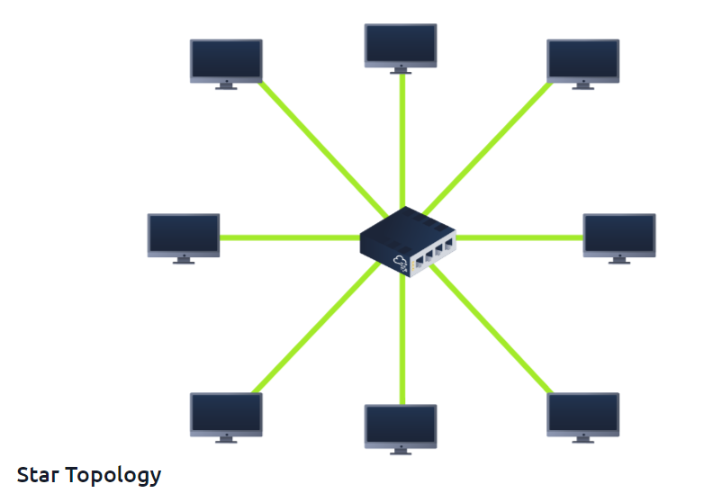
Star topologies are devices that are individually connected through a **switch** or **hub** usually through a **router**

### Networking Devices ###

### Hubs ###

Hub : Basic networking device that broadcasts internet and data to every computer or device it is connected to.

Think of a hub like a speakerphone in a conference call. When someone talks, everyone can hear it, whether it’s meant for them or not.
This means that all devices on the hub get the same data at the same time, and it slows things down if too many people (devices) are trying to talk

### Switches ##
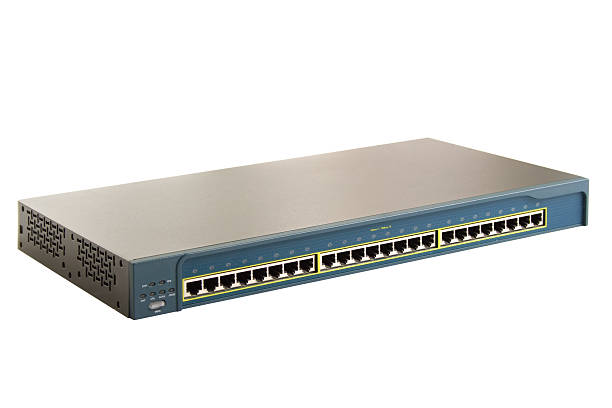
 A switch is also a networking device that has a similar functionality to a hub in that it connects multiple devices within a network. However, unlike a hub, a switch receives internet and data and sends it only to the specific device that requested or is the intended recipient, based on the device's MAC address.

A switch is more like a personal call. It knows exactly who the message is for and sends it directly to that person (device), instead of shouting it to everyone.
This makes things much faster and more efficient because it only sends the data where it needs to go, without bothering other devices.

**Router**
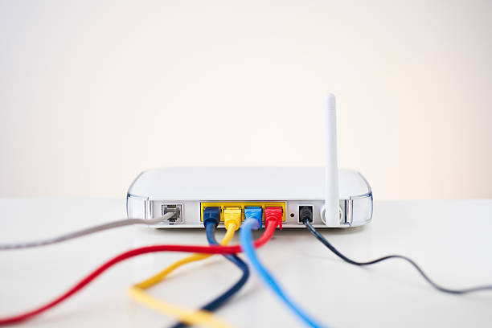
 
A router is a network device that sends internet to devices that are connected to it

 

**Bus topology** 
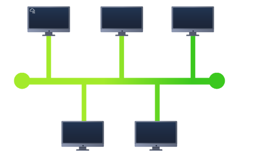
A bus topology operates by having a main cable (backbone cable/ethernet cable) that connects all devices in the network. When data is sent by a device, it travels along the main cable, and each device checks to see if the data is meant for it. If the data is addressed to a particular device, that device receives it. If it’s not, the other devices ignore the data. All devices share the same communication path, and only one device can send data at a time.

Imagine you have several houses on a street, and each house has a mailbox. Instead of each house having its own mailman, there’s one mailman who drives down the street with one big road connecting all the houses. When the mailman has a letter for someone, he drives along the road and stops at each house to check if the letter is for them

**Ring Topology**
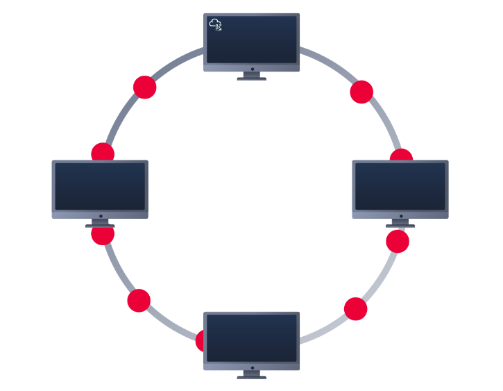
In a ring topology, every device (like computers or other hardware) is connected in a circle, forming a closed loop. Data travels around the ring in one direction (or sometimes both directions in some advanced versions). Each device in the network passes the data to the next one until it reaches its destination. There’s no central hub, and each device acts like a checkpoint that helps pass the data along.

Imagine a group of people sitting in a circle, passing a message or item hand to hand. If person A wants to send a note to person D, the note will go from A to B, then from B to C, and finally from C to D. Each person in the circle checks if the note is for them, and if not, they simply pass it along to the next person

## Practicals ##

**Question** 
What does LAN stand for

  
<strong>Click to see Answer</strong>

  Local Area network

 
 

**Question** 
What is the verb given to the job routers perform (hint:This is the term given to deciding what route packets should take)

  
<strong>Click to see Answer</strong>

  Routing

 

**Question** 
What device is used to centrally connect multiple devices on the local network and transmit data to the **correct location**?(hint: Something smarter than a hub/repeater.)

  
<strong>Click to see Answer</strong>

  Switch

 
 

**Question** 
What topology is cost efficient to set up (hint:*** Topology)

  
<strong>Click to see Answer</strong>

  Bus Topology

 
 

**Question** 
What topology is expensive to set up and maintain (hint**** Topology:)

 
  
<strong>Click to see Answer</strong>

  Star topology

 
 

**Question** 
.Complete the interactive lab attached to this task. What is the flag given at the end?

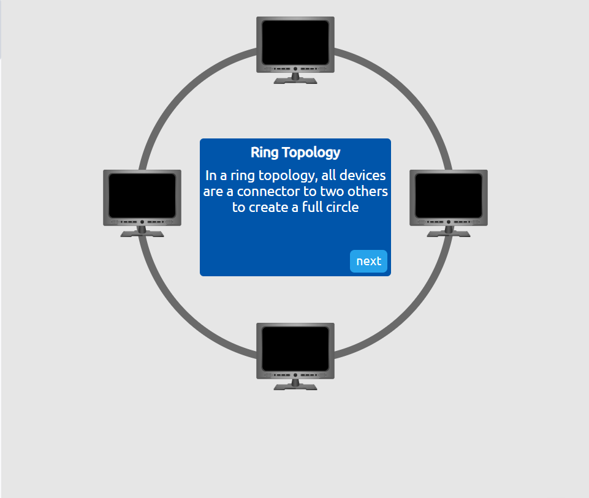
 
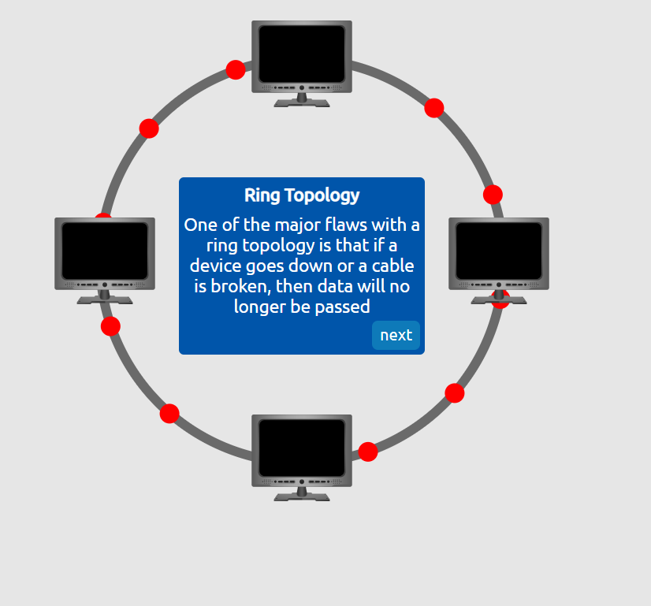
 
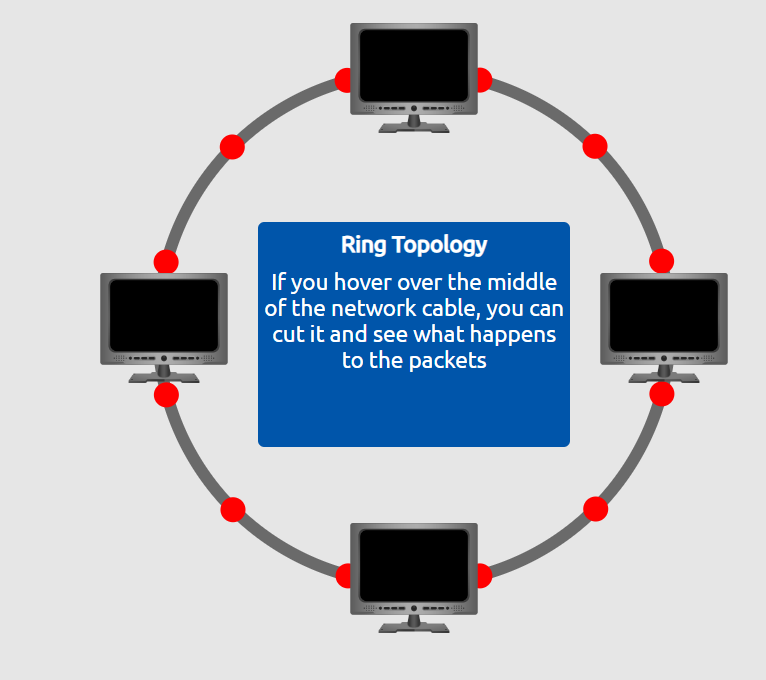
 
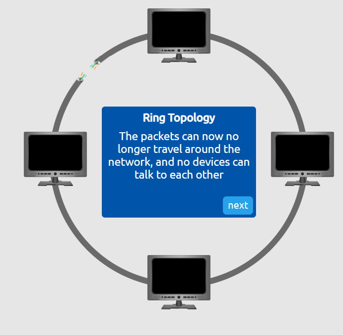
 
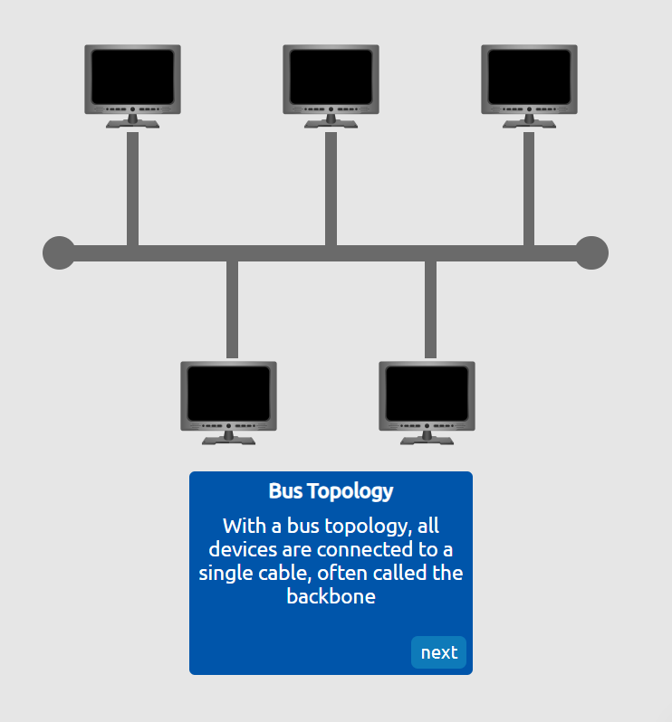
 
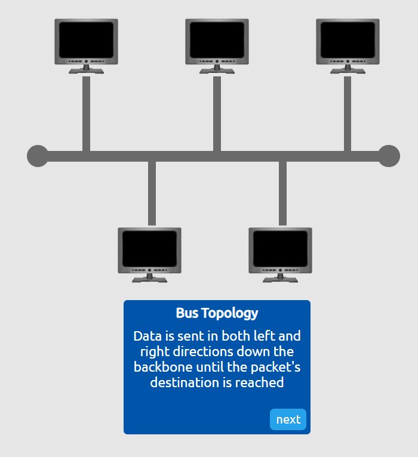
 

 
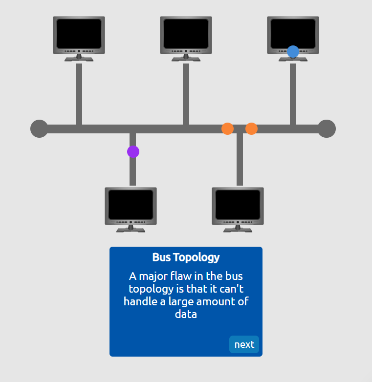
 
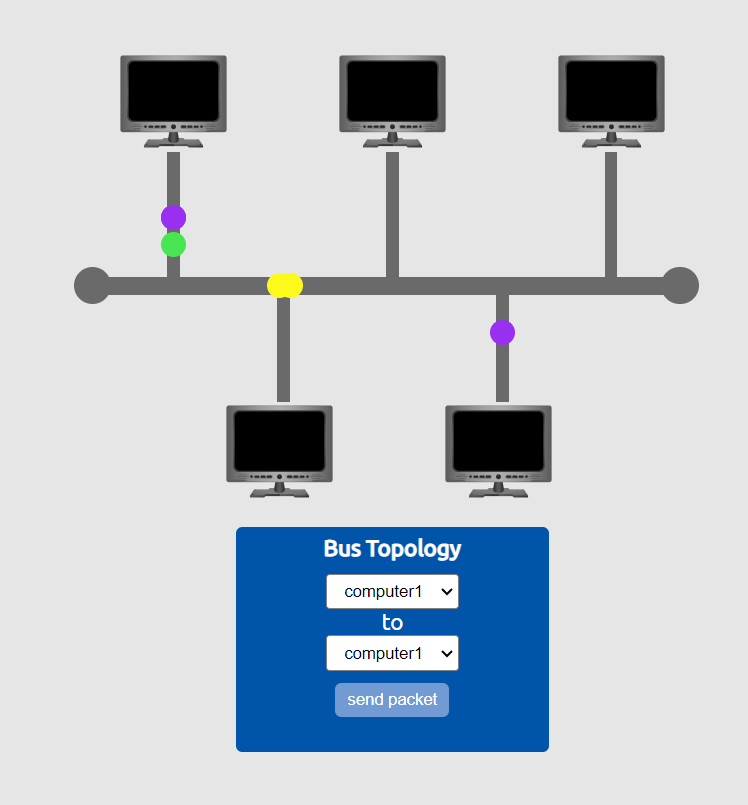
 
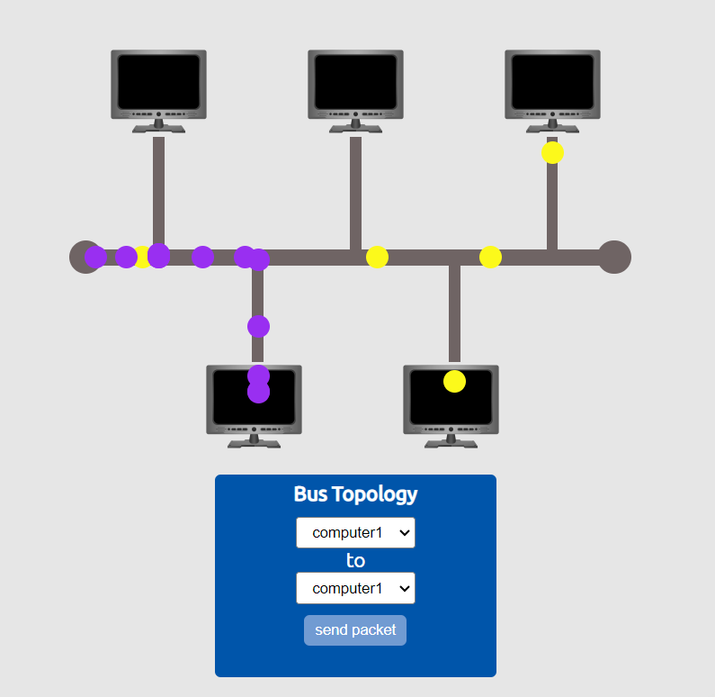
 
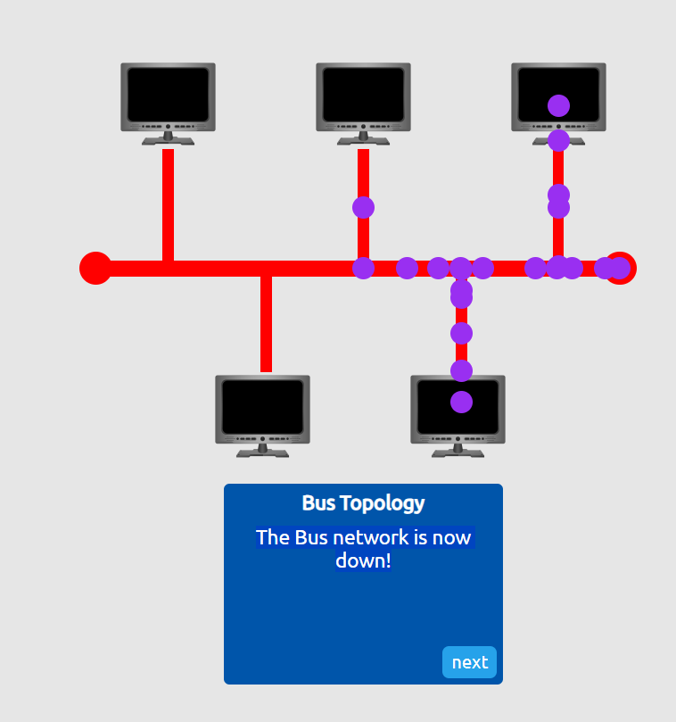
 
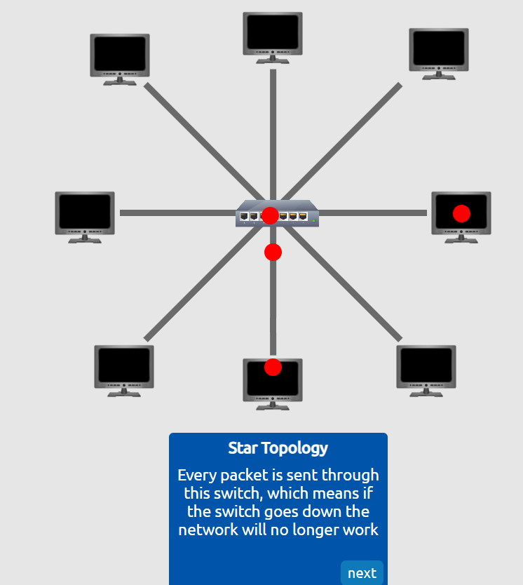
 
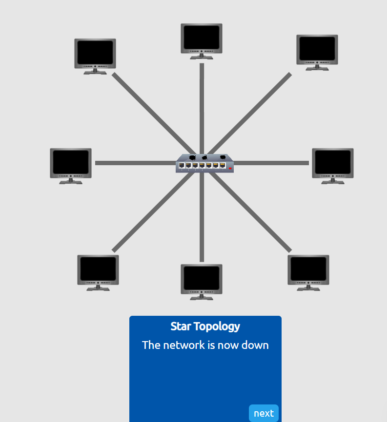

 
  
<strong>Click to see Answer</strong>

  THM{TOPOLOGY_FLAWS}

## Task 2 - A Primer on Subnetting  ##
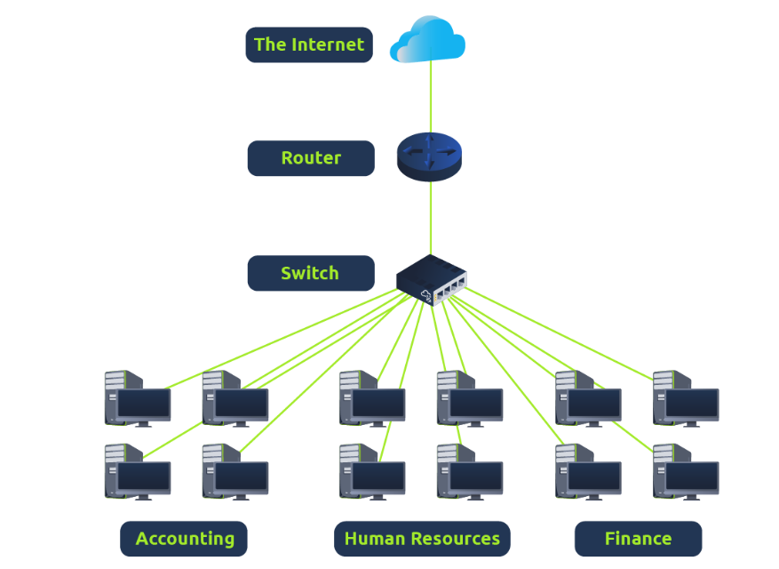
A ***subnet***  is the term given to splitting up a network into smaller, miniature networks within itself.

Imagine you live in a big apartment building. The entire building has one main address, but within that building, each apartment has its own  specific number. That apartment number helps mail carriers deliver packages to the right place.

So, if the main network is a large office building, a subnet might be a specific floor or department that handles its own internet traffic separately from other departments. This helps keep things organized and efficient.

 The name of this feature is called a  ***subnet mask***  that   helps define which part of an IP address is the network portion  and which part is the individual device - This organization makes it simpler to route data within networks and between different networks.

Subnet masks are used for 3 separate functions.

- Network Address
- Host address
- Defult gateway  

Their Definitions in detail: 

1. ***Network Address***

Think of the network address like the name of your street in an apartment complex. It tells you the general area where your apartment is located but doesn’t specify the exact apartment. In a network, the network address identifies the group or "neighborhood" of devices that belong together.

Example:

If the address is 192.168.1.0, it tells us that all devices in this network share the same "street name."

2 . ***Host Address***
The host address is like the specific apartment number in that building. While the network address tells you the street, the host address identifies exactly which house or apartment you're referring to. This ensures messages are delivered to the correct device on the network.

Example:

In 192.168.1.10, the 10 represents the specific device (or "apartment") on the 192.168.1.0 street.

3 .  ***Default Gateway***
The default gateway is like the front door or main entrance of your apartment building. If you need to send something (like a message) to a location outside your street or neighborhood, you first go through the main entrance to access the rest of the world. In a network, the default gateway is usually your router, which connects your local network to the internet or other networks.

Example:

If your device wants to access a website, it sends the request to the default gateway (router), which then forwards it to the correct destination outside your local network.

In Summary:
Network Address: Your "street name" (group of devices). 
Host Address: Your "apartment number" (specific device). 
Default Gateway: The "front door" to access things outside your network 

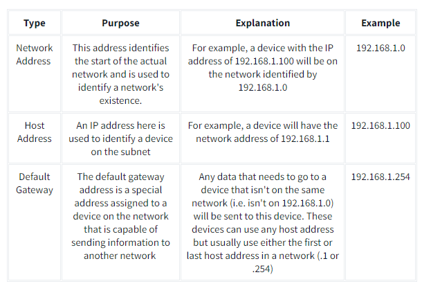

**Question** 
What is the technical term for dividing a network into smaller piece?

 
  
<strong>Click to see Answer</strong>

  subnetting

 
 

**Question** 
How many bits are in a subnet mask(hint:his can be converted into 4 bytes)

 
  
<strong>Click to see Answer</strong>

  32

 
 

**Question** 
What is the range of the section(octet) of a subnet mask?(hint:Smallest to largest)

 
  
<strong>Click to see Answer</strong>

  0-255

 
 

**Question** 
What is adress is used to identify the start of a network (hint:******* Address)

 
  
<strong>Click to see Answer</strong>

  Network adress

 

**Question** 
What is address is used to identify devices withing a network (hint:**** Address)

 
  
<strong>Click to see Answer</strong>

  Host Address

 

**Question** 
What is the name used to identify the device responsible for sending data to another network?

 
  
<strong>Click to see Answer</strong>

  Defult Gateway

 

## Task 3- ARP ##

The ARP protocol is used to make a device identifiable on a local network. It works by sending an ***ARP request*** to find out which device (IP address) has a specific  ***MAC address***.

The device with the matching IP address responds with an ***ARP reply***, stating that it has that corresponding MAC address. The result is stored in an ARP cache, which is used for future communications between devices on the local network. This allows devices to send and receive information accurately within the local network.

**Question** 
What does address resolution stand for

  
<strong>Click to see Answer</strong>

  Addres Resolution Protocol

 

**Question** 
What category of ARP Packet asks for a device wether or not it has a specific IP address

  
<strong>Click to see Answer</strong>

  Request

 

**Question** 
What category of ARP Packet asks a device whether or not it has a specific IP address?

  
<strong>Click to see Answer</strong>

  MAC Address

 

**Question** 
What address is used as a logical identifier for a device on a network?

  
<strong>Click to see Answer</strong>

  IP Address

 

 

## TASK 4 - The DHCP Protocol ##

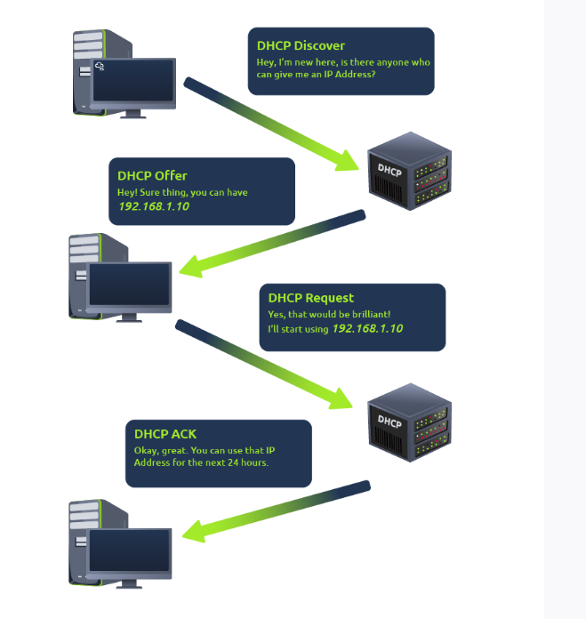

In a nutshell this is used for assigning Public and private IP addresses temporarily to communicate  to a computer.  When a device connects to a network, if it has not already been manually assigned an IP address, it sends out a request ***(DHCP Discover)***
To see if any DHCP servers are on the network. The DHCP server then replies back with an IP address the device could uses ***(DHCP Offer)***.

The device then sends a reply confirming it wants the offered IP Address ***(DHCP Request)***, and then lastly, the DHCP server sends a reply acknowledging this has been completed, and the device can start using the IP Address ***(DHCP ACK)***.

**Question** 
What type of DHCP packet is used by a device to retrieve an IP address?(hint:DHCP ********)

  
<strong>Click to see Answer</strong>

  DHCP Discover

 

**Question** 
What type of DHCP packet does a device send once it has been offered an IP address by the DHCP server0 ?(hint:DHCP Request)

  
<strong>Click to see Answer</strong>

  DHCP Discover

 

**Question** 
Finally, what is the last DHCP packet that is sent to a device from a DHCP server?

  
<strong>Click to see Answer</strong>

  DHCP ACK

 

## TASK 5 - Continue your learning to OSI Model ##
This write-up introduces key concepts and components of Local Area Networks (LANs) and their practical applications. It is organized into five main sections:

LAN Topologies and Networking Devices

Overview of LAN and network topologies such as Star, Bus, and Ring.
Explains the function of networking devices: Hubs, Switches, and Routers.
Practical examples and comparisons, such as how switches improve efficiency over hubs.
Subnetting Basics

Explains the concept of subnetting to divide networks into smaller segments.
Introduces the subnet mask and its components: Network Address, Host Address, and Default Gateway.
Describes how subnetting organizes data flow within a network.
Address Resolution Protocol (ARP)

Details how ARP resolves IP addresses to MAC addresses for device communication within a LAN.
Differentiates between ARP requests and replies.
DHCP Protocol

Explains how the Dynamic Host Configuration Protocol (DHCP) assigns temporary IP addresses to devices.
Breaks down the four key steps: DHCP Discover, Offer, Request, and ACK.
Practical Questions and Tasks

Includes interactive questions and labs to reinforce understanding of key topics.
Covers practical applications of topology, subnetting, ARP, and DHCP.

 
