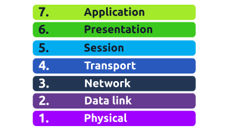
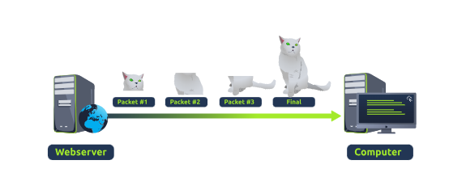
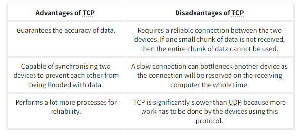
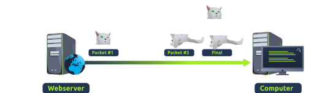
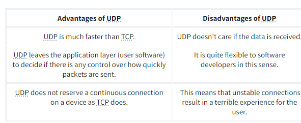

## Task 1 - What is the OSI Model
---

The OSI Model (Open Systems Interconnections) is a  birds eye view  how different network devices communicate with each other.

Here's an acronym to remember it:  

Here's an acronym to help remember the layers of the OSI model in order from layer 1 to layer 7:

**Please Do Not Throw Sausage Pizza Away**

The layers are:
-  **Physical**  
-  **Data Link**  
-  **Network**     
-  **Transport**  
-  **Session**  
-  **Presentation**  
- **Application**

At every individual layer that data travels through, specific processes take place, and pieces of information are added to this data  this process is called encapsulation.

### Answer the Questions Below

**Question:**  
What does the "OSI" in "OSI Model" stand for?

  
<strong>Click to see Answer</strong>

  Open Systems Interconnection

 
 

**Question:**  
How many layers (in digits) does the OSI model have?

  
<strong>Click to see Answer</strong>

  7

 
 

**Question:**  
What is the key term for when pieces of information get added to data?

  
<strong>Click to see Answer</strong>

  Encapsulation

 
 

## Task 2 - Layer 7 - Application
---

The Application Layer (Layer 7) is the part of the OSI model where humans interact with the network. It's the layer you use whenever you browse the internet, send an email, or use an app on your phone or computer. It provides services directly to you, the user, and makes sure that the data you're sending or receiving is ready to be displayed or used by the programs you interact with. The Platform that allows you to interact with is known as the GUI (As covered in the into to offensive to security section)

**Question:**  
What is the name of this Layer?

  
<strong>Click to see Answer</strong>

  Application

 
 

**Question:**  
What is the technical term that is given to the name of the software that users interact with?

  
<strong>Click to see Answer</strong>

  Graphical User Interface

## Task 3 - Layer 6 - Presentation
---

This layer is the translator of data when data is sent or received. So that the information being sent or received by the computer can be understood by the device. This done through a translator

**Question:**  
What is the name of this Layer?

  
<strong>Click to see Answer</strong>

  Presentation

 
 

**Question:**  
What is the main purpose that this Layer acts as?(hint:This layer translates data from one format to another)

  
<strong>Click to see Answer</strong>

Translator

## Task 4 - Layer 5 - Session
---

The session layer (layer 5) synchronises the two computers to ensure that they are on the same page before data is sent and received. Once these checks are in place, the session layer will begin to divide up the data sent into smaller chunks of data and begin to send these chunks (packets) one at a time. This dividing up is beneficial because if the connection is lost, only the chunks that weren't yet sent will have to be sent again — not the entire piece of the data (think of it as loading a save file in a video game).

What is worthy of noting is that sessions are unique — meaning that data cannot travel over different sessions, but in fact, only across each session instead.

For example, when you're on a video call, the session layer helps keep the connection alive and ensures data is properly synchronized between the two devices.

**Question:**  
What is the name of this Layer?

  
<strong>Click to see Answer</strong>

Session

 
 

**Question:**  
What is the technical term for when a connection is successfully established?

  
<strong>Click to see Answer</strong>

Session

 
 

**Question:**  
What is the technical term for "small chunks of data"?

  
<strong>Click to see Answer</strong>

Packets

## Task 5 - Layer 4 - Transport
---

The Transport Layer is like a traffic controller. It makes sure that data is sent and received correctly between devices. If any data gets lost along the way, it will resend it, ensuring everything arrives in order. It's like sending multiple packages through the mail and making sure they arrive at their destination in the correct order and without anything missing.
 

 This made possible through 2 protocols, TCP(Transmission Control Protocol) and UDP (User Datagram Protocol). **TCP** functions by where the sender sends broken packets of where the receiver re-arranges the packets to ensure it get the whole message

TCP is used for situations such as file sharing, internet browsing or sending an email. This usage is because these services require the data to be accurate and complete (no good having half a file!).

  Here are their advantages and disadvantages.
 

The **UDP** functions by sending  the packets without checking whether the packets we received or not. However it does have it merits

UDP is useful in situations where there are small pieces of data being sent. For example, protocols used for discovering devices (ARP and DHCP that we discussed in Room 2 - Intro to LAN) or larger files such as video streaming (where it is okay if some part of the video is pixelated. Pixels are just lost pieces of data!)

**Question:**  
What is the name of this Layer?

  
<strong>Click to see Answer</strong>

Transport

 
 

**Question:**  
What does TCP stand for?

  
<strong>Click to see Answer</strong>

Transmission Control Protocol

 
 

**Question:**  
What does UDP stand for?

  
<strong>Click to see Answer</strong>

User Datagram Protocol

 
 

**Question:**  
What protocol guarantees the accuracy of data?

  
<strong>Click to see Answer</strong>

TCP

 
 

**Question:**  
What protocol doesn't care if data is received or not by the other device?

  
<strong>Click to see Answer</strong>

UDP

 
 

**Question:**  
What protocol would an application such as an email client use?

  
<strong>Click to see Answer</strong>

TCP

 
 

**Question:**  
What protocol would an application that downloads files use?

  
<strong>Click to see Answer</strong>

TCP

 
 

**Question:**  
What protocol would an application that streams video use?

  
<strong>Click to see Answer</strong>

UDP

## Task 6 - Layer 3 - Network
---
The Network Layer is like the GPS or map for data. It figures out the best route for the data to travel from one device to another, even if they're far apart. This is done by the OSPF(Open Shortest Path First) and RIP(Routing Information Protocol) It breaks the data into packets and directs them across the internet or network to reach the right IP address.

**Question:**  
What is the name of this Layer?

  
<strong>Click to see Answer</strong>

Network

 
 

**Question:**  
Will packets take the most optimal route across a network? (Y/N)

  
<strong>Click to see Answer</strong>

 Y

 
 

**Question:**  
What does the acronym "OSPF" stand for?

  
<strong>Click to see Answer</strong>

 Open Shortest Path First

 
 

**Question:**  
What does the acronym "RIP" stand for?

  
<strong>Click to see Answer</strong>

 Routing Information Protocol

 
 

**Question:**  
What type of addresses are dealt with at this layer?(Devices on a network use these. For example, 192.168.1.100)

  
<strong>Click to see Answer</strong>

 IP Addresses

## Task 7 - Layer 2 - Data Link
---
The Data Link Layer is like a postman, making sure the data is delivered from one device to another within the same local network (like your home or office network on the network interface card ). It’s responsible for error detection and correction, ensuring that the data being transmitted is accurate and doesn't have any issues.

**Question:**  
What is the name of this Layer?

  
<strong>Click to see Answer</strong>

Data Link

 
 

**Question:**  
What is the name of the piece of hardware that all networked devices come with?

  
<strong>Click to see Answer</strong>

Network Interface Card

## Task 8 - Layer 1 - Physical
---
The Physical Layer is the hardware layer, dealing with the actual physical connections, like  ethernet cables, switches, Wi-Fi signals, and anything that physically transfers data. It’s the layer that sends electrical signals, light signals (in fiber optics), or radio waves (in wireless) to transmit the data. All of this information is relayed to the computer in their language as something called binary

**Question:**  
What is the name of this Layer?

  
<strong>Click to see Answer</strong>

Physical

 
 

**Question:**  
What is the name of the numbering system that is both 0's and 1's?

  
<strong>Click to see Answer</strong>

Binary

 
 

**Question:**  
What is the name of the cables that are used to connect devices?

  
<strong>Click to see Answer</strong>

Ethernet Cables

## Task 9 - Practical - OSI Game
---
**Question:**  
Escape the dungeon to retrieve the flag. What is the flag? (Hint: Use the OSI MODEL to guide you)

  
<strong>Click to see Answer</strong>

  THM{OSI_DUNGEON_ESCAPED}

## Task 10 - Continue Your Learning: Packets & Frames
---

[Packets & Frames](/packets&frames)
