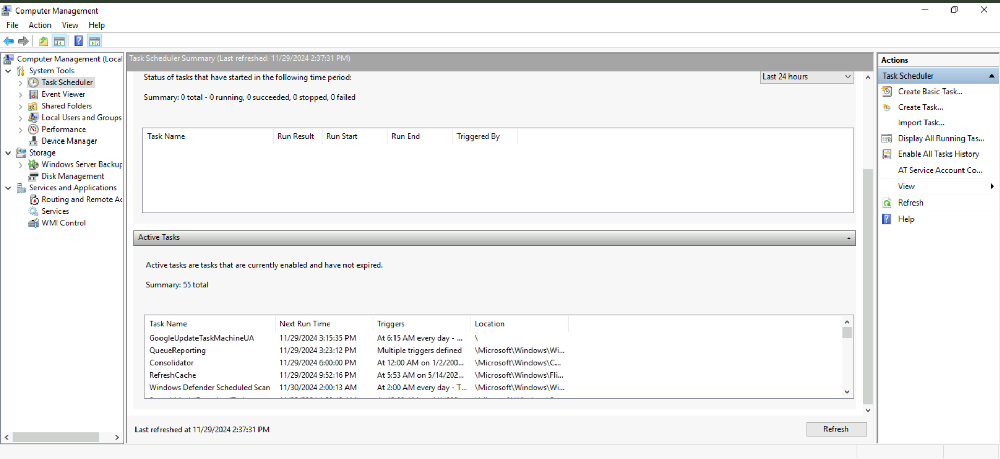
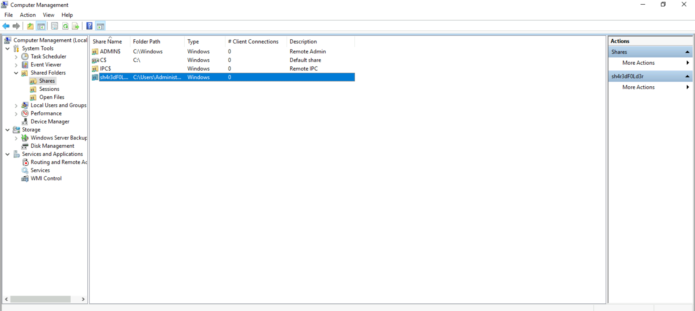
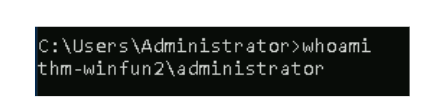

## Task 1 - Introduction ##


## Task 2 - System Configuration ##

The ***System Configuration utility***, also called MSConfig, is a tool on your computer that helps fix problems when your computer starts up. Think of it as a troubleshooting assistant—it lets you find and fix things that might be slowing your computer down or causing errors when it turns on.

You can open this tool in a few ways. One simple way is to use the Start Menu. If you need detailed instructions on how to use this tool, check out this [document](https://learn.microsoft.com/en-us/troubleshoot/windows-client/performance/system-configuration-utility-troubleshoot-configuration-errors) for more information.


***Note***: You need local administrator rights to open this utility.

The utility has five tabs across the top. Below are the names for each tab. We will briefly cover each tab in this task.:

- General
- Bot
- Services
- Startup
- Tools


In the General tab, we can select what devices and services for Windows to load upon boot. The options are: ***Normal***, ***Diagnostic***, or ***Selective***.

In the Boot tab, we can define various boot options for the Operating System.


The ***Services*** tab lists all services configured for the system regardless of their state (running or stopped). A service is a special type of application that runs in the background.


In the ***Startup*** tab, you won't see anything interesting in the attached VM.  Below is a screenshot of the Startup tab for MSConfig from my local machine.


As you can see, Microsoft advises using Task Manager (taskmgr) to manage (enable/disable) startup items. The System Configuration utility is NOT a startup management program.

Note: If you open Task Manager for the attached VM, you will notice that Task Manager doesn't show a Startup tab.

There is a list of various utilities (tools) in the Tools tab that we can run to configure the operating system further. There is a brief description of each tool to provide some insight into what the tool is for.


Notice the Selected command section. The information in this textbox will change per tool.

To run a tool, we can use the command to launch the tool via the run prompt, command prompt, or by clicking the Launch button.


***Question***<br>
What is the name of the service that lists Systems Internals as the manufacturer?

***Step 1*** search the system configuration utility  .Thats where we can find the all the services


***Step 2***
Run as administrator on to have full access to all features.


***Step 3***
If you scroll through all the services you'll see the services that lists the System internals as the manufacturer


<details>
  <summary><strong>Click to see Answer</strong></summary>
  PsShutdown
</details>


***Question***<br>
Whom is the Windows license registered to?
<details>
  <summary><strong>Click to see Answer</strong></summary>
  Windows User
</details>


***Question***<br>
What is the command for Windows Troubleshooting?
***Step 1***
same as before search the system configuration utility  .Thats where we can find the all the services


***Step 2***
Run as administrator on to have full access to all features.


***Step 3***
Scroll over to tool and click on it.


***Step 4***
Click on launch on the "About Windows" and you'll see "This product is licensed under the Microsoft Software License Terms to:<ANSWER>


<details>
  <summary><strong>Click to see Answer</strong></summary>
control.exe
</details>


***Question***<br>
What command will open the Control Panel? (The answer is  the name of .exe, not the full path and research to find answer

<details>
  <summary><strong>Click to see Answer</strong></summary>
control.exe
</details>


## Task 3 Change UAC settings ##


***Question***<br>
What is the command to open User Account Control Settings? (The answer is the name of the .exe file, not the full path and research)

<details>
  <summary><strong>Click to see Answer</strong></summary>
UserAccountControlSettings.exe
</details>


## Task 4 Change UAC settings ##


In short In simple terms, Computer Management is a tool in Windows that helps you control and check different parts of your computer to make sure it's working properly.

If you want to:

Manage your computer's hardware:<br>
You can see what devices (like printers or cameras) are connected and make sure their drivers are working right.

Check your hard drive:<br>
You can see how much space you have on your computer and manage things like creating new folders or partitions on your hard drive.

Look at error messages or logs:<br>
You can check for any warnings or problems that might be happening in the background.
Control running programs and services: You can stop or start background programs that help your computer run, like antivirus software or file-sharing services.
It's a tool mainly used by people who fix or manage computers, but it can also be useful for you to solve simple computer issues or get a better idea of what's going on inside your system.

Lets go over the features of the Computer Management..

<br>


<br>


WMI Control is a tool that helps manage and control a feature in Windows called Windows Management Instrumentation (WMI). WMI is a system built into Windows that allows programs, scripts, and even administrators to gather information or make changes to the system.

For example, it can be used to check system performance, manage hardware settings, and track software across many computers, either locally or over a network. Think of WMI as a way for IT professionals to remotely monitor and manage multiple computers at once, without needing to physically touch each one.

Historically, there was a command-line tool called WMIC (Windows Management Instrumentation Command-line) to interact with WMI. However, as of a newer version of Windows (Windows 10, version 21H1), WMIC has been replaced by Windows PowerShell, a more advanced tool. PowerShell offers more powerful capabilities and is now the preferred way to work with WMI.


***Question***<br>
What is the command to open Computer Management (The answer is the name of the .msc file, not the full path)


<details>
  <summary><strong>Click to see Answer</strong></summary>
  Compmgmt
</details>


***Question***<br>
At what time every day is the GoogleUpdateTaskMachineUA task configured to run?

To solve this we go to the task manager, scroll on active tasks then you'll eventually see it with the time it starts.


<details>
  <summary><strong>Click to see Answer</strong></summary>
  6:15
</details>


***What is the name of the hidden folder that is shared?***

***Step 1***
Click on shared folders to see all the shared sharedfolderscomputermanagement



***Step2***
Look through the shares and you will eventually see the hiden share.


<details>
  <summary><strong>Click to see Answer</strong></summary>
  sh4r3dF0Ld3r
</details>


## Task 5  -  System Information ##


Environment variables are like special settings or pieces of information that the operating system and programs use to understand how things should work on your computer. These settings can include important details like where Windows is installed, how many processors your computer has, and where temporary files are stored.

For example, the WINDIR environment variable tells programs where Windows is installed, so they know where to find the necessary files to run. Other variables might tell programs where to store files temporarily or where to look for certain resources.

When you click on Environment Variables, you'll see a list of these settings and their values for the virtual machine (VM). This is where you can find or change these details to help programs run properly.
[](/)


***Question***<br>
What is the command to open System Information (The answer is the name of the .exe file not the full path)

<details>
  <summary><strong>Click to see Answer</strong></summary>
  msinfo32.exe

</details>

***Question***<br>
What is listed under System Name?

***Step 1***<br>
Run the command to to view system information:msinfo32.exe
Alternaitvely you can search system information on the search bar

***Step 2***<br>
Seive through the items and you'll eventually see the item that is listed under  system name

<details>
  <summary><strong>Click to see Answer</strong></summary>
  THM-WINFUN2
</details>

***Question***<br>
Under Environment Variables, what is the value for ComSpec?

***Step*** 1 <br>
Go to  Software environment. (Its the software environment is the setup and configuration of everything that makes the system and its programs work.)


<details>
  <summary><strong>Click to see Answer</strong></summary>
  THM-WINFUN2
</details>

***Step 2***<br>
Sieve through and you will see the name of the variable.


## Task 6  -  Resource Monitor ##

***Resource Monitor*** (Resmon) is a built-in tool in Windows that helps you understand how your computer is working. It shows what programs and services are using your computer's power and resources, like the brain (CPU), storage (disk), internet (network), and memory (RAM). Here's a simpler explanation of what it does and its four sections:

***What Resource Monitor Does:***<br>
It’s like a dashboard for your computer’s activity. It shows:

What’s using your computer’s power (like apps running in the background).
How much space or internet bandwidth is being used.
Which programs are stuck or causing problems.


It also lets you:<br>
End a program that's frozen or unresponsive.
Figure out why your computer is slow (for example, by spotting a program using too much memory).
The Four Sections of Resource Monitor:


***CPU*** (The Brain):<br>
Shows which programs are actively "thinking" and using your computer's processing power.
Example: If your computer is slow, you can check if one program is overworking the CPU.


***Disk*** (Storage):<br>
Tells you which programs or files are being read from or written to your hard drive or SSD.
Example: If saving a file takes too long, you might see that another program is heavily using the disk.

***Network (Internet)***:<br>
Displays which programs are using the internet and how much data they’re sending or receiving.
Example: If your internet feels slow, you can see if one app is using all the bandwidth.

***Memory (RAM)***:<br>
Shows how much temporary working memory each program is using.
Example: If you run out of memory, your computer might slow down or crash. This section helps find the culprit.
Why Use It?

Imagine your computer is a kitchen. Resource Monitor shows:

Which chef (program) is hogging the stove (CPU).<br>
What food is being taken from the fridge (disk).<br>
How much water is being used (network).<br>
Which chefs are taking up counter space (memory).<br>
If something is slowing down your kitchen, Resmon helps you find out why so you can fix it.


***Question***<br>
What is the command to open Resource Monitor? (The answer is the name of the .exe file, not the full path)


<details>
  <summary><strong>Click to see Answer</strong></summary>
resmon.exe
</details>


## Task 7  -  Command Prompt ##

***Hostname***<br>
The ```hostname``` command is like asking your computer, "What’s your name?" When you type ``hostname`` into the command prompt and press Enter, the computer will simply tell you its name. This name is what identifies your computer on a network, just like your name identifies you to others. It's especially helpful if you're working on a network with many computers and need to know which one you're dealing with.


***Whoami***<br>
The ```whoami``` command is like asking the computer, "Who am I logged in as?" When you type ```whoami``` in the command prompt and press Enter, the computer will tell you the username of the account you're currently using. This is helpful if you're not sure which account you're logged into, especially on shared or work computers.




***ipconfig***<br>

In simple terms, ipconfig is a command used on Windows computers to check or manage your internet connection settings. Think of it like a tool that shows information about your computer’s network setup, like:

Your computer's IP address (like your device's home address on the internet).
The gateway address (the address of your router, which connects you to the wider internet).
Subnet mask (a kind of divider to organize networks).
You can also use it to do things like:

Refresh your connection when it's not working properly.
Get a new IP address if you're having network issues.
It’s like asking your computer, “Hey, what’s my internet setup?”


Every command on your computer has a help guide that explains how to use it, including the options (called "parameters") you can add to make it do more specific tasks.

To see this guide, you can use /?, which is like saying, "Show me how this works."


For example, if you want to learn what the ipconfig command can do, you type:<br>
```ipconfig /?```<br>
This will show a list of all the things you can do with ipconfig, like:

- Displaying your IP address.<br>
- Renewing your connection.<br>
- Releasing your current IP address.<br>

It’s basically a cheat sheet for using the command!

Note: To clear the command prompts, the command is
```cls```


***Netstat***<br>
What is netstat?<br>
Netstat is a tool you can use on your computer to see information about your network connections and how your computer is communicating with other devices, both on the internet and within your local network.


Think of it Like This:
Imagine your computer is like a house with multiple doors (connections) open to the outside world. netstat is like a security camera system that shows you:

Who’s Coming and Going:

***Active Connections***: It shows all the current connections your computer has with other devices. For example, it can tell you which websites you’re connected to or which other computers on your network are communicating with yours.
Which Programs Are Using the Internet:

***Program Activity***: It can reveal which applications or programs on your computer are using the internet. So, if you’re wondering which app is using your bandwidth, netstat can help identify it.
Traffic Details:

***Data Flow***: It provides information about how much data is being sent and received through each connection. This helps you understand your network usage, like how much data you're downloading or uploading.

***Why is netstat Useful?***

***Troubleshooting***: If your internet is slow or something isn’t working right, netstat can help you see if there are unusual connections or if a specific program is causing issues.

***Security***: It can help you spot any unexpected connections, which might indicate unauthorized access or malicious activity.
Monitoring: If you want to keep an eye on your network activity to ensure everything is running smoothly, netstat provides the details you need.


To use netstat, you open the Command Prompt and type:
```netstat```

This will display a list of all current network connections and some statistics about them. You can also add extra options (parameters) to get more specific information, just like with ipconfig.


***The Netstat Command***<br>


Think of ***netstat*** as a tool that shows you details about your computer's network connections.
You can use it on its own by just typing netstat in the command line, and it will give you basic information.
If you add options like -a, -b, or -e (called "parameters"), it changes what netstat shows.
For example:<br>
- a might show all connections, even the ones not currently active.<br>
- b might include the names of the programs using the network.<br>
- e could show detailed statistics, like how much data is being sent or received.<br>

The point? You can "customize" what information netstat gives you by adding these parameters/options.

***The net Command***<br>

Think of ***net*** as a manager for network-related tasks on your computer.
On its own, if you type just ***net***, it will list different "jobs" it can help you with, like:<br>
Managing shared folders.<br>
Controlling connected devices.<br>
Checking network settings.<br>

To actually do something, you need to follow net with one of these jobs, called "sub-commands. As shown in the image above

Think of it like a "network manager" that helps you interact with other computers and devices on your network.

If you you where unsure about about the command to use, use this: ```net help```


so for example if you where unsure on "net user" type it up and it will show the commands purpose. The format is net help <name of the command> as shown below


In Summary
***netstat*** is like a dashboard or a monitoring tool that gives you a clear view of all the network activity happening on your computer. It helps you see who you’re connected to, what programs are using the network, and how data is flowing, making it easier to manage and troubleshoot your internet and network connections.


Whereas ***net*** is a handy tool for handling network resources, connecting with other devices, and configuring settings on your computer or across your network.

Here's the link to all the command prompts [here](https://ss64.com/nt/)

***Question***<br>
In System Configuration, what is the full command for Internet Protocol Configuration?

***First step*** type system configuration in the search bar.


***Second Step***
Hover to tools and scroll down until you come across Internet protocol configuration.You'll Eventually see the full command. The Windows Registry is like a big, organized filing cabinet where Windows stores important information about your computer. It keeps track of things like:

User profiles: Information about each person who uses the computer.
Applications: Which programs are installed and what types of files they can open or create.
Folder and icon settings: Custom settings for how folders and program icons look or behave.
Hardware: Information about devices connected to your computer, like printers or USB drives.
Ports: Details about the digital "doors" used to communicate with other devices, like the internet.
It’s a key part of how the computer works, and Windows looks at this information all the time while it's running. However, it's for experienced users only because changing things in the registry can mess with how the computer operates. One way to access it is through a tool called the Registry Editor (regedit).

<details>
  <summary><strong>Click to see Answer</strong></summary>
C:\Windows\System32\cmd.exe /k %windir%\system32\ipconfig.exe
</details>


***Question***<br>
For the ipconfig command, how do you show detailed information?(Research to find the command)

<details>
  <summary><strong>Click to see Answer</strong></summary>
ipconfig /all
</details>

## Task 8  -  Registry Editor ##


The Windows Registry is like a big, organized filing cabinet where Windows stores important information about your computer. It keeps track of things like:

User profiles: Information about each person who uses the computer.<br>
Applications: Which programs are installed and what types of files they can open or create.<br>
Folder and icon settings: Custom settings for how folders and program icons look or behave.<br>
Hardware: Information about devices connected to your computer, like printers or USB drives.<br>
Ports: Details about the digital "doors" used to communicate with other devices, like the internet.<br>
It’s a key part of how the computer works, and Windows looks at this information all the time while it's running. However, it's for experienced users only because changing things in the registry can mess with how the computer operates.
 One way to access it is through a tool called the Registry Editor (regedit).


## Task 9 - Conclusion ##


<br>
<br>


See you in the next room..
