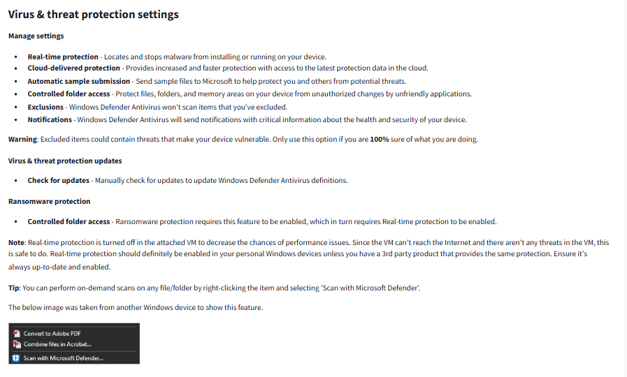

## Task 1 - Introduction ##

 
 

## Task 2 - Windows Update ##

Sure! Here’s a simplified explanation of Windows Update:

What is Windows Update?
It’s a tool built into Windows that keeps your computer up-to-date. It automatically downloads and installs updates to improve security, fix bugs, and add new features. It also updates other Microsoft programs, like the built-in antivirus software, Microsoft Defender.

When do updates happen?
Microsoft usually releases updates once a month on the second Tuesday—this day is called Patch Tuesday.

But if there’s a big problem or a critical fix needed (like to stop a security threat), Microsoft can release updates outside this schedule. Your computer will get these important updates as soon as they’re available.

How can I use Windows Update?
You’ll find it in your computer's Settings:

Open the Start menu and click Settings (or press Windows key + I).
Go to Update & Security > Windows Update.
Shortcut Tip: You can also open it directly by typing this into the Run box (press Windows key + R):
control /name Microsoft.WindowsUpdate

This command works like a quick cheat to jump straight to the update screen.

Why is it important?
Updates are like maintenance for your computer—they keep it safe from hackers, fix problems, and make sure everything runs smoothly. If you skip updates, your system could be at risk.

Why do people avoid Windows Updates?
In the past, many Windows users delayed or skipped updates because:

They didn’t want to deal with the hassle of restarting their computer.
It was easy to ignore updates completely.
What changed in Windows 10?
Microsoft made updates harder to ignore.

You can still delay an update for a little while if you’re busy.
But eventually, Windows will install the update and restart your computer automatically to make sure your device stays safe.
Why does this happen?
Updates are important because they fix security holes and bugs. Skipping them can leave your computer vulnerable to hackers or other issues.

What happens when a restart is needed?
After installing an update, Windows might show a screen that says a Restart is required. You’ll have a few options:

Restart right away.
Schedule the restart for a time that works best for you (like when you’re done with work).
Let Windows decide the best time to restart.
This makes it easier for you to manage updates without interrupting what you’re doing.

***Question*** 
There were two definition updates installed in the attached VM. On what date were these updates installed?

  
<strong>Click to see Answer</strong>

5/3/2021

### Task 3 - Windows security ###

***Question*** 
In the above image, which area needs immediate attention?

  
<strong>Click to see Answer</strong>

Virus & threat protection

### Task 4 - Virus and Threat Protection ###

 

 

 
 

***Question*** 
Specifically, what is turned off that Windows is notifying you to turn on?

  
<strong>Click to see Answer</strong>

Real-time protection

### Task 5 - Firewall & network protection ###

A firewall is like a gatekeeper for your computer or network. It decides which data can come in or go out by checking it first, much like a security guard checking IDs at a door. If the data doesn't have the right "credentials," the firewall stops it from passing through, keeping your system safe from threats.

For example:

Imagine your computer is a house.
The firewall is the front door with a guard.
Only people (data) you trust can come inside or leave.
If someone suspicious tries to enter, the guard stops them. Similarly, the firewall ensures that harmful or unauthorized information doesn't enter or leave your computer, protecting it from viruses, hackers, or other dangers.

When you navigate to "Firewall & network protection" in Windows, you can see and manage these rules and decide what’s allowed or blocked.

Here’s the difference between the three firewall profiles

Domain:
This profile is for networks that belong to your workplace or organization. It applies when your computer is connected to a trusted company network, like an office, where it can verify (authenticate) itself with a domain controller—a system that confirms you’re part of the network.
Think of it like being in your company’s building with a badge to prove you work there.

Private:
This profile is for trusted home or private networks, like your Wi-Fi at home. Here, you can allow devices (like your printer, smart TV, or other computers) to communicate with each other safely.
It’s like being at home with close family—everyone knows and trusts each other.

Public:
This is the default profile for networks you don’t trust, like Wi-Fi at a coffee shop, airport, or hotel. It’s the most restrictive because it assumes there could be threats. Your computer doesn’t allow unnecessary connections from other devices to protect you.
Imagine being in a busy public space, keeping your personal information safe from strangers.

What happens when you click on a profile?
When you click on a firewall profile, you get two simple options:

Turn the firewall on/off:
Turning it on activates protection, like keeping your gate locked. Turning it off removes that protection (not recommended unless necessary).

Block all incoming connections:
Enabling this blocks all unsolicited connections, even from trusted apps, for extra safety. It’s like locking your door and refusing to answer even if someone knocks unless you initiated the interaction.

***Question*** 
If you were connected to airport Wi-Fi, what most likely will be the active firewall profile?

  
<strong>Click to see Answer</strong>

Public network

### Task 6 - App and  Browser control ###

Microsoft Defender SmartScreen is like a digital warning system for your computer. It helps protect you from harmful websites, apps, or files by checking if they are safe before you interact with them.

Here's how it works in simple terms:
Website Protection:
If you’re about to visit a suspicious or fake website (like one pretending to be your bank), SmartScreen warns you and stops you from accessing it.

App Protection:
If you download or try to use an app that could harm your computer (like one designed to steal your data), SmartScreen alerts you before you open it.

File Protection:
If you try to download a file that might contain malware (software that can harm your device), SmartScreen steps in to prevent the download or warn you about the risks.

Imagine SmartScreen as a trusted friend who double-checks everything you interact with online or download, ensuring you don’t accidentally run into trouble. You can change its settings in this section if you want it to be more or less strict, depending on your needs.

***Question***
Read the above

### Task 7 - Device Security ###

***Question***
What is the TPM?

  
<strong>Click to see Answer</strong>

Public network

A Trusted Platform Module (TPM) is like a secure locker inside your computer, designed to keep sensitive information safe from hackers or malware.

How it works in simple terms:
Extra Security Hardware:
The TPM is a tiny, dedicated chip on your computer's motherboard. It’s like having a safe within your computer that no one can break into.

Protects Important Stuff:
It securely handles sensitive data like encryption keys, passwords, or certificates. For example, if your computer encrypts your files, the TPM safely stores the key used to lock and unlock them.

Tamper-Resistant:
The chip is built with special features to prevent anyone (or any malicious software) from interfering with or stealing the secure data inside. It’s like having a tamper-proof safe that sounds an alarm if someone tries to break it open.

Used for Trusted Features:
TPM supports functions like Windows Hello (facial or fingerprint login) and BitLocker (file encryption), ensuring these tools have a reliable and secure foundation to work on.

Think of TPM as a dedicated security guard for your computer, protecting your most sensitive information and ensuring no one else can access or mess with it.

***Question*** 
What is the TPM?

  
<strong>Click to see Answer</strong>

Trusted Platform Module

## Task 8 - Bit Locker ##

What is BitLocker?
BitLocker is a feature in Windows that protects the data on your computer by encrypting it. Encryption means locking your data so that only you (or someone with the correct key) can unlock and access it.

Why is it useful?
BitLocker is especially helpful if:

Your computer is lost or stolen. Without the encryption key, no one can access your data, even if they take out your hard drive and try to use it on another computer.
You want to make sure no one can read your sensitive data if you’re disposing of or recycling your computer.

How does it work with TPM?
If your computer has a Trusted Platform Module (TPM) chip (the secure hardware we discussed earlier), BitLocker becomes even more secure. The TPM works with BitLocker to:

Store the encryption key safely: It keeps the key locked away inside the hardware, making it very hard for anyone to steal it.
Detect tampering: If someone tries to change your computer’s hardware or software while it’s turned off, the TPM and BitLocker will notice and lock everything down to protect your data.

Think of your data as valuables in a bank vault.
BitLocker is the vault door that locks everything up.
TPM is the high-tech lock system that ensures only you can open the door, and it detects if someone tries to tamper with it.
If your computer doesn’t have TPM, BitLocker can still work, but it won’t be as secure.

Refer to the official Microsoft documentation to learn more about BitLocker [here](https://learn.microsoft.com/en-us/windows/security/operating-system-security/data-protection/bitlocker/).

***Question*** 
What must a user insert on computers that DO NOT have a TPM version 1.2 or later?(hint:Refer to the Microsoft documentation on BitLocker.)

  
<strong>Click to see Answer</strong>

USB startup key

### Task 9 - Volume Shadow Copy Service ##

The ***Volume Shadow Copy Service (VSS)*** is a Windows feature that creates backups, called shadow copies, of your data at specific points in time. These shadow copies are stored in a hidden area on your computer called the System Volume Information folder.

What does VSS do?
If System Protection is turned on, VSS helps you:

Create Restore Points: Save a snapshot of your system’s settings and files at a particular moment.
Perform System Restore: Go back to a previous restore point if something goes wrong (like a bad update or a system issue).
Adjust Restore Settings: Decide how much space your computer uses for these backups or turn the feature on/off.
Delete Restore Points: Free up space by removing old snapshots.
Why is this important for security?
VSS can help recover your system after a problem, but cybercriminals know this. Many types of malware, especially ransomware, are programmed to find and delete these shadow copies. If this happens, you lose the ability to recover your files using VSS alone.

How to stay safe:
To protect yourself from these attacks:

Keep an offline or off-site backup: Store backups on an external drive or a cloud service that malware can’t reach.
Use strong security tools: Make sure you have antivirus software to detect and stop malware before it can delete your shadow copies.
In simple terms:

Think of VSS as an automatic camera that takes snapshots of your computer’s important files and settings so you can go back to them if needed.
But if malware sneaks in, it might try to delete these snapshots to stop you from recovering. Having extra backups stored somewhere safe is your best defense.

***Question*** 
What is VSS

  
<strong>Click to see Answer</strong>

Volume Shadow Copy Service

## Task 10 - Conclusion ##

Conclusion
In this walkthrough, we explored essential Windows features and security mechanisms that play a vital role in keeping systems secure, up-to-date, and functioning efficiently. Here's a quick recap:

- Windows Update ensures your system is protected against the latest threats by installing critical patches and updates. 
- Windows Security and Virus & Threat Protection safeguard your system from malware and other vulnerabilities. 
- Firewall & Network Protection acts as a digital gatekeeper, filtering unwanted traffic and ensuring only trusted connections. 
- App & Browser Control through Microsoft Defender SmartScreen prevents malicious apps, files, and websites from harming your system. 
- Device Security and the Trusted Platform Module (TPM) provide hardware-based encryption and secure storage for sensitive data. 
- BitLocker protects your data by encrypting it, making it inaccessible to unauthorized users. 
- Volume Shadow Copy Service (VSS) offers a way to recover from unexpected changes or errors by maintaining snapshots of your system's state. 

Understanding and properly configuring these features is crucial for maintaining a secure and stable Windows environment. As you work through these tasks, you're not only enhancing your technical knowledge but also building the skills necessary to secure and manage Windows systems effectively.

