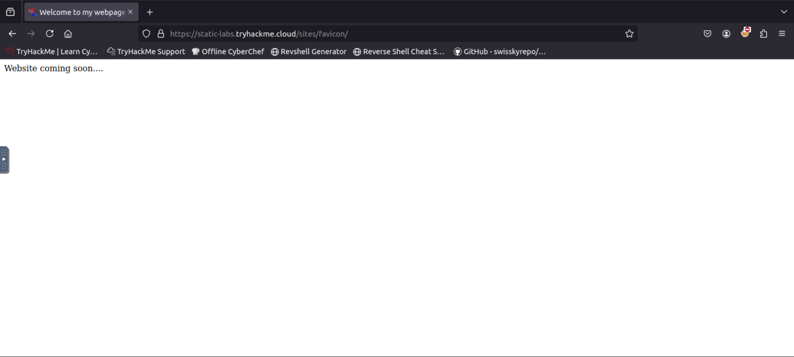
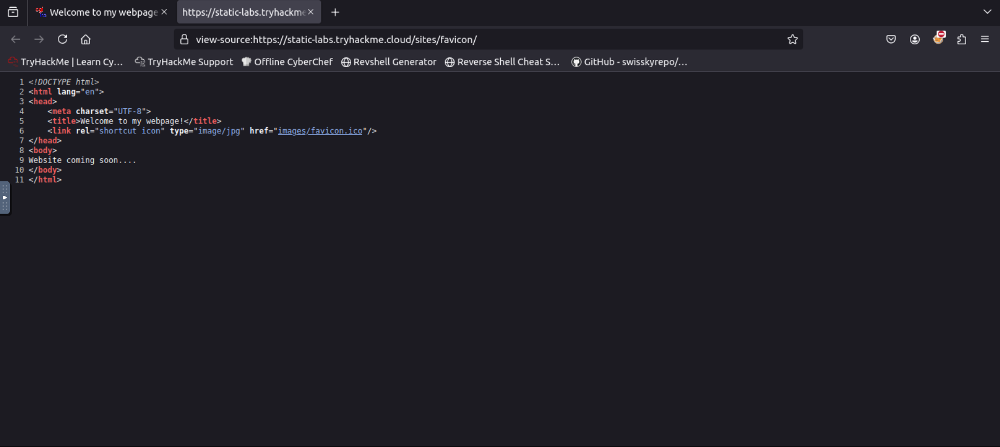
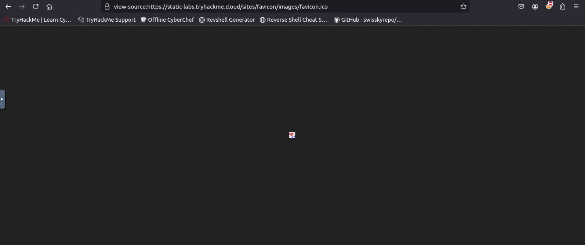
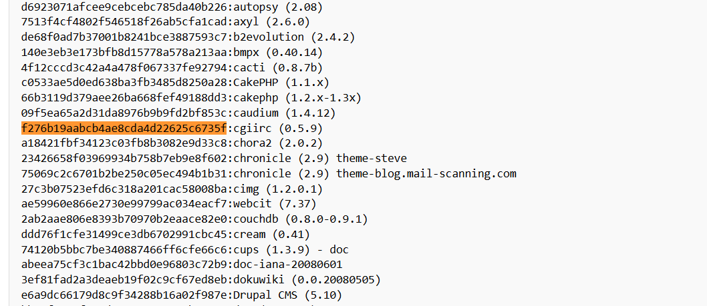

## Task 1- What is Content Discovery?  ##

Content discovery in web application security is all about finding hidden or less obvious parts of a website that aren’t immediately visible to regular users. These parts might include staff-only areas, older versions of the website, backups, or admin panels.

When we talk about "content," it could mean anything from files, images, and videos to website features or configuration files.

The goal of content discovery is to uncover these hidden pieces, which might not be meant for public access, as they could contain sensitive or useful information for an attacker.

There are three main ways to do this:

1. ***Manually***: Searching by hand, trying out different URLs, or exploring the website step by step.
2. ***Automated***: Using tools to scan the site and find hidden paths, files, or features faster.
3. ***OSINT*** (Open-Source Intelligence): Gathering information about the site from public sources like search engines, forums, or cached data.
If you're on a platform like TryHackMe, starting the "AttackBox" (a virtual environment for hacking practice) will let you practice finding this hidden content on a specific machine.

***Question***<br>
What is the Content Discovery method that begins with M?
<details>
  <summary><strong>Click to see Answer</strong></summary>
  Mannual
</details>


***Question***<br>
What is the Content Discovery method that begins with A?
<details>
  <summary><strong>Click to see Answer</strong></summary>
  Automated
</details>


***Question***<br>
What is the Content Discovery method that begins with O?
<details>
  <summary><strong>Click to see Answer</strong></summary>
  OSNIT
</details>


## Task 2 - Manual Discovery - Robots.txt ##

When we’re exploring a website to uncover hidden areas, one of the first places to check is the robots.txt file. This file is like a set of instructions for search engines, telling them which parts of the site they can or cannot display in search results. Website owners often use this file to keep certain sections, like admin panels or private files, from being easily found.

As penetration testers, we look at the robots.txt file because it can unintentionally reveal valuable information about restricted or hidden parts of the website. Think of it like finding a map where the owner accidentally marked “Do Not Enter” zones—they might be hiding something interesting.

To check the robots.txt file on the Acme IT Support website, you open Firefox on the AttackBox and go to this URL:
http://MACHINE_IP/robots.txt

When you visit this page, you'll see the contents of the file. If the site owner has listed any restricted areas, they’ll appear here. For example, it might list something like /admin-panel or /hidden-files, which you can then investigate further. :


***Question***<br>
What is the directory in the robots.txt that isn't allowed to be viewed by web crawlers?

<details>
  <summary><strong>Click to see Answer</strong></summary>
/staff-portal
</details>


## Task 3 - Manual Discovery - Favicon  ##

The ***favicon*** is a tiny icon you see in your browser's tab or address bar when visiting a website. It’s mostly used for branding, like a little logo to represent the site.

However, this favicon can sometimes reveal useful clues to penetration testers. Here's why:

When websites are built using frameworks (pre-made tools to help developers create websites faster), the default favicon from that framework might get left behind if the developer forgets to replace it with a custom one. This default favicon can act like a "calling card," giving away what framework the website is using.

For example, if a website still has the default icon from a tool like WordPress or Django, it tells us what technology is running in the background. Knowing this helps us look up vulnerabilities or ways to exploit that specific framework.

You can use the OWASP favicon database (at the link provided) to match the target site's favicon with known framework icons. If you find a match, you’ve just uncovered part of the website's tech stack, giving you a starting point to dig deeper.

***Practical Exercise***

Go to the link  https://static-labs.tryhackme.cloud/sites/favicon/
and you'll see a note from the website.  view the page source and you'll see th(at on /images/facicon.ico there's a ico

Go the terminal on the attack box and get the MD5 hash value

which you can search [here]( https://static-labs.tryhackme.cloud/sites/favicon/) by copying and pasting the results in the search bar by using control + f


First we to go the directory: /favicon


Then we click on page source to view the path of the favicon image which is needed. Click on it


This is what it should look like but we are afrer is the the link in the search bar. Copy that  and add curl + the link you copied + | md5sum. The value where after helps us indidcate the version of the favicon that is being used.



Like this:
```
root@ip-10-10-193-246:~#  curl https://static-labs.tryhackme.cloud/sites/favicon/images/favicon.ico | md5sum
  % Total    % Received % Xferd  Average Speed   Time    Time     Time  Current
                                 Dload  Upload   Total   Spent    Left  Speed
100  1406  100  1406    0     0  20376      0 --:--:-- --:--:-- --:--:-- 20376
f276b19aabcb4ae8cda4d22625c6735f  
```

Now we search using control f and pasting the value, to find the favicon


***Question***
***What framework did the favicon belong to?***

<details>
  <summary><strong>Click to see Answer</strong></summary>
  cgiirc
</details>


## Task 4 - Manual Discovery - Sitemap.xml ##

The sitemap.xml file is like a roadmap for search engines, telling them which pages or files on a website should be indexed and appear in search results. Unlike the robots.txt file, which prevents search engines from accessing certain pages, the sitemap.xml file points them to pages that should be visible.

When you visit the sitemap.xml file of a website, it lists URLs (web pages) that the site owner wants search engines to consider. Sometimes, this file can also include older pages or less obvious content that isn't easy to find through regular navigation on the site. These could be pages that are still working but are hidden from the main navigation or newer content that hasn't been discovered yet.

To check the Acme IT Support website's sitemap.xml, you would open the link in the Firefox browser on the AttackBox. This will show you the list of pages they've highlighted for search engines to index. You might discover some hidden content or find out if there’s anything new or outdated.


First we type the path /sitemap.xml path to that webpage

<bR>

Then we go to that page . If you look at the circles parts of the code you can see the all the dircetories of the website. Keep looking and you'll see one that stands out.
<br>

Here's what is looks like opened.
<br>

***Question***

<details>
  <summary><strong>Click to see Answer</strong></summary>
  /s3cr3t-area
</details>

## Task 5 Manual Discovery - HTTP Headers ##
TTP headers are like labels on a package you receive. They contain extra information about the request and response between your browser (or tool) and the web server. When you visit a website, your browser sends a request, and the server responds with data to load the page, along with some headers that describe details about the server and the communication.

These headers can tell us:

What web server software is being used (e.g., Apache, NGINX).
What programming languages or technologies the server runs (e.g., PHP, Python).
Other technical information that might help figure out how the website works or if it's vulnerable to attacks.
By using the curl command with the -v option (verbose mode), we can simulate a browser requesting a webpage and see the headers the server sends back. For example:


```
user@machine$ curl http://10.10.4.80 -v
*   Trying 10.10.4.80:80...
* TCP_NODELAY set
* Connected to 10.10.4.80 (10.10.4.80) port 80 (#0)
> GET / HTTP/1.1
> Host: 10.10.4.80
> User-Agent: curl/7.68.0
> Accept: */*
>
* Mark bundle as not supporting multiuse
< HTTP/1.1 200 OK
< Server: nginx/1.18.0 (Ubuntu)
< X-Powered-By: PHP/7.4.3
< Date: Mon, 19 Jul 2021 14:39:09 GMT
< Content-Type: text/html; charset=UTF-8
< Transfer-Encoding: chunked
< Connection: keep-alive

```


***Question***

What is the flag value from the X-FLAG header?(Hint:Make sure you've started the AttackBox. The flag that starts with THM{ will show in the terminal response from the curl command.)

<details>
  <summary><strong>Click to see Answer</strong></summary>
  THM{HEADER_FLAG}
</details>


## Task 6 - Framework Stack ##


When exploring a website, you can often find hints about what software or framework it's built on. These clues might be hidden in plain sight, such as comments in the HTML code, copyright notices, or credits on the page. Once you identify the framework, you can visit its official website to learn more about how it works, find documentation, and discover related features or paths.

For example, the Acme IT Support website has a clue in its page source (HTML code). If you look at the code, you'll find a comment at the end of each page mentioning the page load time and a link to the framework's website:
https://static-labs.tryhackme.cloud/sites/thm-web-framework

By visiting the framework's website and checking its documentation, you'll find information about the administration portal—a special part of the website where administrators manage the system. Using that path, you can try accessing the admin portal on the Acme IT Support website (not the framework's site). If successful, you’ll find a flag—a marker used in challenges like this to confirm you've completed a step.

In short
- Look at the website’s code for hints about the framework.

- Use the framework's documentation to find key features or paths, like the admin portal

- Apply what you learn to explore the original website and uncover hidden content or flags.


***Question***
What is the flag from the framework's administration portal?

<details>

  <summary><strong>Click to see Answer</strong></summary>
  THM{CHANGE_DEFAULT_CREDENTIALS}
</details>


First we go to the https://static-labs.tryhackme.cloud/sites/thm-web-framework/
 to view the framework:


 Next we click on documentation because it gives us info on how to login as admin like this:


Now that we're oon the admin page log in  and retrieve the flag . It's similar to one of the exercises we did earlier. Don't worry it was redesigned to teach this concept:


## Task 7 - OSNIT - Google Hacking/Dorking  ##

Open-Source Intelligence (OSINT) involves gathering publicly available information to learn more about a target, like a website. One popular OSINT technique is Google Hacking or Google Dorking, which uses Google's advanced search features to uncover specific and often hidden content.

Here’s how it works in simple terms:

Key Filters in Google Dorking:
***site:***<br>
Example: ```site:tryhackme.com```
Shows results only from the specified website.
Helps you focus on a specific target.

***inurl***:<br>
Example: ```inurl:admin```

Finds pages with "admin" in the URL, like tryhackme.com/admin.
Useful for locating admin panels or directories.

<br>
***filetype:***<br>
Example: ```filetype:pdf```

Finds specific types of files, like PDFs or Word documents.
Great for uncovering reports, manuals, or other sensitive files.
<br>

***intitle:***<br>
Example: ```intitle:admin```
Searches for pages with a specific word in the title, like "admin."
Useful for finding login pages or key areas of a site.<br>


### Combining filters  <br>
You can stack filters to refine your search. For instance:<br>
```site:tryhackme.com inurl:login intitle:"Admin"```

This would show login pages on tryhackme.com with "Admin" in the title.

### Why is this Important? ###
Find hidden content: Discover admin pages, backup files, or other sensitive areas that aren’t linked on the main site.
Understand the site structure: Learn how the website is organized to identify potential entry points.
<br>
Uncover mistakes: Spot files or pages that shouldn’t be publicly accessible.

In essence, Google Dorking is like being a detective with a super-powered search engine, helping you uncover hidden gems and understand your target better.


***Question***
What Google dork operator can be used to only show results from a particular site?


<details>
  <summary><strong>Click to see Answer</strong></summary>
  site:
</details>

## Task 8 - Wappalyzer ##
Wappalyzer (https://www.wappalyzer.com/) is an online tool and browser extension that helps identify what technologies a website uses, such as frameworks, Content Management Systems (CMS), payment processors and much more, and it can even find version numbers as well.


***Question***<br>
What online tool can be used to identify what technologies a website is running?

<details>
  <summary><strong>Click to see Answer</strong></summary>
  Wappalyzer
</details>


## Task 9 - OSNIT - Wayback Machine  ##


The Wayback Machine (https://archive.org/web/) is a historical archive of websites that dates back to the late 90s. You can search a domain name, and it will show you all the times the service scraped the web page and saved the contents. This service can help uncover old pages that may still be active on the current website.

***Question***
What is the website address for the Wayback Machine?

<details>
  <summary><strong>Click to see Answer</strong></summary>
  https://archive.org/web/
</details>


## Task 10 - OSNIT - Github ##

To understand GitHub, you first need to understand Git. Git is a ***version control system*** that tracks changes to files in a project. Working in a team is easier because you can see what each team member is editing and what changes they made to files. When users have finished making their changes, they commit them with a message and then push them back to a central location (repository) for the other users to then pull those changes to their local machines. GitHub is a hosted version of Git on the internet. Repositories can either be set to public or private and have various access controls. You can use GitHub's search feature to look for company names or website names to try and locate repositories belonging to your target. Once discovered, you may have access to source code, passwords or other content that you hadn't yet found.

***Question***<br>
What is Git?


<details>
  <summary><strong>Click to see Answer</strong></summary>
  version control system
</details>

## Task 11 - OSNIT S3 Buckets  ##

S3 buckets are like cloud-based filing cabinets provided by Amazon's AWS service. People use them to store files like documents, images, or even parts of websites that can be accessed through the internet. Each bucket has a unique address (URL) that looks like this:
http(s)://{name}.s3.amazonaws.com
Here, {name} is chosen by the owner, such as "tryhackme-assets."

The owner decides who can access the files:

Public: Anyone can see or download the files.<br>
Private: Only the owner or authorized users can access the files.<br>
Writable: Others can add, delete, or change files in the bucket (which is usually a mistake).<br>


This is important because sometimes, people accidentally set the permissions incorrectly, leaving sensitive files accessible to anyone. This could include private documents, company data, or website components that shouldn’t be public.

***How to Discover S3 Buckets***:<br>
Check the source code: Look at the HTML or JavaScript of a website for S3 bucket links.<br>
Search in repositories: Developers sometimes accidentally upload S3 URLs to places like GitHub.<br>
Automation: Use tools to guess bucket names by combining the company name with common words, such as:

- {name}-assets
- {name}-private
- {name}-www

Example:
If the company is called "example," you could check these possible bucket URLs:

example-assets.s3.amazonaws.com
example-public.s3.amazonaws.com
example-private.s3.amazonaws.com


Discovering incorrectly secured S3 buckets can reveal:

- Sensitive files or confidential data.
- Misconfigured permissions that might allow you to upload or delete files.
- Hidden parts of websites or applications.

In sipmle  terms, S3 buckets are like digital closets. If the lock (permissions) isn’t set properly, anyone walking by can open the door and take a peek—or worse, rearrange the contents!


***Question***<br>
What URL format do Amazon S3 buckets end in?

<details>
  <summary><strong>Click to see Answer</strong></summary>
.s3.amazonaws.com
</details>


## Task 12 Automated Discovery ##


Automated Discovery is a way to use tools to find hidden files, directories, or pages on a website without manually searching for them. Instead of guessing page names one by one, automated tools send a huge number of requests to the website quickly, checking if certain files or directories exist. This can reveal parts of the website that aren’t publicly linked, like admin areas, test pages, or backups.

What Are Wordlists?
Wordlists are like dictionaries used by these tools. They’re text files containing common filenames or directories that people often use, such as admin, login, backup, or config.php. These lists help the tools know what to search for.

A popular collection of wordlists is called SecLists, and it includes lists for all kinds of purposes, like finding directories, passwords, and more. It’s available online and preinstalled on the TryHackMe AttackBox.

Automation Tools:
Several tools are commonly used for automated discovery. Here are three you might encounter:

ffuf:
A fast and flexible tool that uses wordlists to find hidden content by making lots of requests to the website.

dirb:
An older but reliable tool that also scans for directories and files on websites using wordlists.

gobuster:
A powerful tool that’s especially good for brute-forcing directories and subdomains.

How It Works:
You pick a tool and a wordlist.
The tool sends requests to the website for each word in the list (e.g., checking if http://example.com/admin or http://example.com/backup exists).
If the website responds positively, you’ve found a hidden resource.
Why Is This Useful?
Automated discovery can uncover:

Sensitive files accidentally left on the server.
Hidden sections of a website, like admin panels.
Backup files or old versions of the site that might have vulnerabilities.
In simple terms, automated discovery is like trying every key on a keyring to see which ones open a door—except you let a tool do it for you!

Here are 3 tools can be used for contetn discovery. Use the commands to practice and find the flag .


ffuf:
```
ffuf -w /usr/share/wordlists/SecLists/Discovery/Web-Content/common.txt -u http://10.10.160.65/FUZZ
 ```

 Using dirb:

```
 dirb http://10.10.160.65/ /usr/share/wordlists/SecLists/Discovery/Web-Content/common.txt
```


Using Gobuster:
```
gobuster dir --url http://10.10.160.65/ -w /usr/share/wordlists/SecLists/Discovery/Web-Content/common.txt

```


<br>
<br>
<br>


***Question***<br>
What is the name of the directory beginning "/mo...." that was discovered?


If you usef the ffuf command you will see a result like this.Search for the directory:
```
:: Progress: [2415/4655] :: Job [1/1] :: 2621 req/sec :: Duration: [0:00:01] :: :: Progress: [2576/4655] :: Job [1/1] :: 2529 req/sec :: Duration: [0:00:01] :: monthly                 [Status: 200, Size: 28, Words: 4, Lines: 1]
:: Progress: [2720/4655] :: Job [1/1] :: 3092 req/sec :: Duration: [0:00:01] :: news                    [Status: 200, Size: 2538, Words: 518, Lines: 51]
:: Progress: [2815/4655] :: Job [1/1] :: 2897 req/sec :: Duration: [0:00:01] ::

```


<details>
  <summary><strong>Click to see Answer</strong></summary>
/monthly
</details>


***Question***<br>
What is the name of the log file that was discovered?

If you usef the gobuster command you will see a result like this. Search for the log file:
```
root@ip-10-10-17-204:~#  gobuster dir --url http://10.10.229.69/ -w /usr/share/wordlists/SecLists/Discovery/Web-Content/common.txt
===============================================================
Gobuster v3.6
by OJ Reeves (@TheColonial) & Christian Mehlmauer (@firefart)
===============================================================
[+] Url:                     http://10.10.229.69/
[+] Method:                  GET
[+] Threads:                 10
[+] Wordlist:                /usr/share/wordlists/SecLists/Discovery/Web-Content/common.txt
[+] Negative Status codes:   404
[+] User Agent:              gobuster/3.6
[+] Timeout:                 10s
===============================================================
Starting gobuster in directory enumeration mode
===============================================================
/assets               (Status: 301) [Size: 178] [--> http://10.10.229.69/assets/]
/contact              (Status: 200) [Size: 3108]
/customers            (Status: 302) [Size: 0] [--> /customers/login]
/development.log      (Status: 200) [Size: 27]
/monthly              (Status: 200) [Size: 28]
/news                 (Status: 200) [Size: 2538]
/private              (Status: 301) [Size: 178] [--> http://10.10.229.69/private/]
/robots.txt           (Status: 200) [Size: 46]
/sitemap.xml          (Status: 200) [Size: 1383]
Progress: 4655 / 4656 (99.98%)
===============================================================
Finished
===============================================================

```
<details>
  <summary><strong>Click to see Answer</strong></summary>
/development.log
</details>
