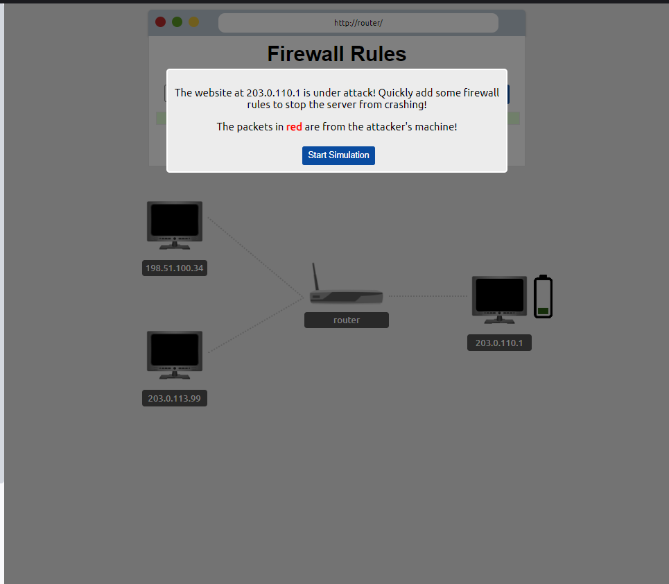

## Task 1 -  Introduction to Port Forwarding  ##

What is Port Forwarding? 
Port forwarding is a networking technique used to direct incoming internet traffic to a specific device or service on a private network. It tells your router which internal device should handle data arriving on a specific port. This is essential for making internal services, like web servers or gaming applications, accessible from outside your local network.

Imagine your home network is a hotel, and each device is a room. The hotel has one main reception desk (your router) that handles all visitors.

If someone from the outside world wants to deliver something (like visit your web server), they first arrive at the reception desk. Without instructions (port forwarding), the receptionist won’t know which room to send them to, so the delivery stops there.

Port forwarding is like leaving instructions with the receptionist: “If anyone shows up asking for Room 80 (your web server), send them directly to Room 10 (your computer).”

Without these instructions, outside visitors can’t reach the specific room or service they’re looking for.
Without these instructions, outside visitors can’t reach the specific room or service they’re looking for.

**Question** 

What is the name of the device that is used to configure port forwarding?

  
<strong>Click to see Answer</strong>

  Router

## Task 2 - Firewalls 101 ##
Firewalls help control the flow of data between devices. There are two main types:

***Stateless Firewall*** 
This type of firewall looks at the entire connection, not just individual pieces of data (packets).
It makes decisions based on the overall connection between devices.

***Stateful Firewall*** 
This firewall checks each piece of data (packet) to see if it follows the rules.
It can block bad data without blocking the entire device.

**Question** 
What layers of the OSI model do firewalls operate at(hint: Provide the layers, replacing the following "x" and "y" with the appropriate layer in ascending order (i.e. 1,2): Layer x, Layer y)

 When a packet of data (like a digital letter) arrives at a firewall, it’s analysed based on its source, destination, and port numbers. The firewall then decides what to do with the packet:

Pass: If the packet meets the firewall’s rules and is allowed to proceed, it’s said to “pass” through the firewall. This means the packet is forwarded to its intended destination, just as if there were no firewall in place.

Drop: If the packet doesn’t meet the firewall’s rules or is deemed malicious, it’s “dropped”. This means the packet is discarded and never reaches its intended destination. It’s essentially erased from existence.

Think of it like a physical gatekeeper:

Pass: The gatekeeper lets you through, and you can continue on your way. 
Drop: The gatekeeper refuses to let you in, and you’re turned away.

  
<strong>Click to see Answer</strong>

  Layer 3, Layer 4

**Question** 
What category of firewall inspects the entire connection?

  
<strong>Click to see Answer</strong>

  Stateful

**Question** 
What category of firewall inspects individual packets?

  
<strong>Click to see Answer</strong>

  stateless

## Task 3 Practical - Firewall ##

Deploy the static site attached to this task. You must correctly configure the firewall to prevent the device from overloading to receive the flag!

**Question** 
What is the flag?

**Why did this work?**

***1st step***. We identified the source Ip address of the attacker - 198.51.100.34

***2nd step***. We identified what was being attacked, the websiteon the server  - 203.0.11.01
This information allows to identify where the traffic is coming from and going it's to so we can modify the traffic. Put in wrong address and you won't be able do anything about the attack. Lets keep going.

***3rd step.*** we identify what port its using. The introduction states that the **WEBSITE** was being attacked. This leaves a clue because the port used for website traffic is port 80.

With this we have pin pointed the exact location of the traffic precisely but how do we change. That's when drop and pass actions come to play

***4th step***. We use the drop action to stop the packets at the router and to  not the website.

***5th step***. we point the Source Ip address - 203.0.113.99

With the destination Ip address port and the right port action in place. We have successfully blocked all the attacks.

There is no need to block the other user from using the internet. You will eventaully get message if you blocked the user and the

  
<strong>Click to see Answer</strong>

  THM{FIREWALLS_RULE}

BONUS:
If you are interested in this type of attack, Its known as the DDOS(Distributed Denial of Service) attack when a the attacker over sends packets to shutdown the server hosting data.

## Task 4  VPN Basics ##
A ***VPN (Virtual Private Network)*** is like a secure tunnel for your internet traffic. Here’s an easy way to think about it.

***Without a VPN*** 
When you browse the internet normally, all the information you send and receive (like the websites you visit, the things you search for, or your messages) travels directly from your device (phone, computer) to the website’s server. Anyone with the right tools, like your internet provider or hackers on public Wi-Fi, could potentially see what you’re doing online.

***With a VPN*** 
A VPN creates a private, encrypted tunnel between your device and the internet. This means that everything you do online first goes through this tunnel, which scrambles your data so no one can easily read it.
The VPN then sends your data out to the internet using a different IP address (the address that identifies your device). Instead of your real IP address (which shows your location), it uses the IP address of the VPN server. This hides where you are and what you're doing online.

***Why use a VPN?*** 
***Privacy***: It hides your internet activity from others, like your internet provider, advertisers, or hackers on public Wi-Fi.

***Security***: It protects your data, especially when using unsecured networks like coffee shop Wi-Fi, making it harder for hackers to steal information. 

 
***Accessing Blocked Content***: A VPN can make it look like you're browsing the internet from a different location. This is useful for accessing websites or services that are restricted in certain countries.

## Task 4 - VPN Basics ##

A ***VPN (Virtual Private Network)*** is like a secure tunnel for your internet traffic. Here’s an easy way to think about it.

***Without a VPN*** 
When you browse the internet normally, all the information you send and receive (like the websites you visit, the things you search for, or your messages) travels directly from your device (phone, computer) to the website’s server. Anyone with the right tools, like your internet provider or hackers on public Wi-Fi, could potentially see what you’re doing online.

***With a VPN*** 
A VPN creates a private, encrypted tunnel between your device and the internet. This means that everything you do online first goes through this tunnel, which scrambles your data so no one can easily read it.  
The VPN then sends your data out to the internet using a different IP address (the address that identifies your device). Instead of your real IP address (which shows your location), it uses the IP address of the VPN server. This hides where you are and what you're doing online.

***Some existing VPN'S***

Other types not listed include:
- Remote Access VPN
- Site-to-Site VPN
- Client-Based VPN
- SSL/TLS VPN
- OpenVPN
- MPLS VPN (Multiprotocol Label Switching)
- Hybrid VPN
- Cloud VPN
- Mobile VPN

**Question** 
What VPN technology only encrypts & provides the authentication of data?

  
<strong>Click to see Answer</strong>

  PPP

 

**Question** 
What VPN technology uses the IP framework?

  
<strong>Click to see Answer</strong>

  IPSec

## Task 5 - LAN Networking Devices ##

***Router***: As mentioned in in the intro_to_lan section,  A **Router** is a network device that sends internet to devices that are connected to it

***Switch***: A switch is also a networking device that s multiple devices within a network. A switch receives internet and data and sends it only to the specific device that requested or is the intended recipient, based on the device's MAC address.

***Question*** 
What is the verb for the action that a Router does?

  
<strong>Click to see Answer</strong>

  Routing

 
 

**Question**
What are the two different layers of switches? Separate these by a comma I.e.: LayerX,LayerY

  
<strong>Click to see Answer</strong>

  Layer2,Layer3

## Task 6 - Network simulator  ##
Deploy the static site attached to this task. And experiment with the network simulator. The simulator will break down every step a packet needs to take to get from point a to b. Try sending a TCP packet from computer1 to computer3 to reveal a flag.

Note: Please use the Chrome or Firefox browser to complete this practical exercise.

**Question** 
What are the two different layers of switches? Separate these by a comma I.e.: LayerX,LayerY

  
<strong>Click to see Answer</strong>

  Layer2,Layer3

 
 

## Task 6 - Network Simulator  ##

Deploy the static site attached to this task. And experiment with the network simulator. The simulator will break down every step a packet needs to take to get from point a to b. Try sending a TCP packet from computer1 to computer3 to reveal a flag.

Note: Please use the Chrome or Firefox browser to complete this practical exercise.

**Question** 
What is the flag from the network simulator? (Try sending a TCP packet from computer1 to computer3 to reveal a flag.)

  
<strong>Click to see Answer</strong>

  THM{YOU'VE_GOT_DATA}

 
 

**Question** 
How many HANDSHAKE entries are there in the Network Log?(Count the TCP handshake packets in the log)

  
<strong>Click to see Answer</strong>

  5

This blog explored key networking concepts, including port forwarding, firewalls, VPNs, and LAN devices. Through practical exercises, we learned how firewalls mitigate DDoS attacks, VPNs enhance privacy and security, and switches and routers manage network traffic.
