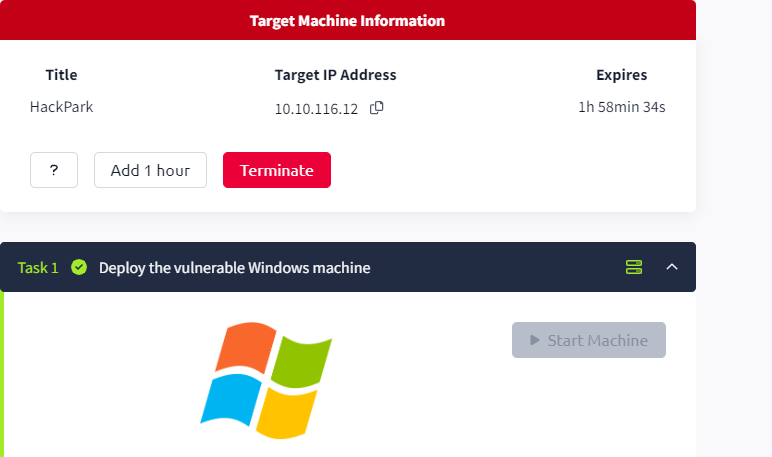
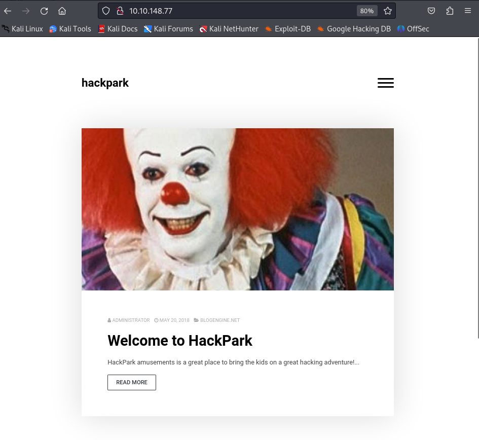
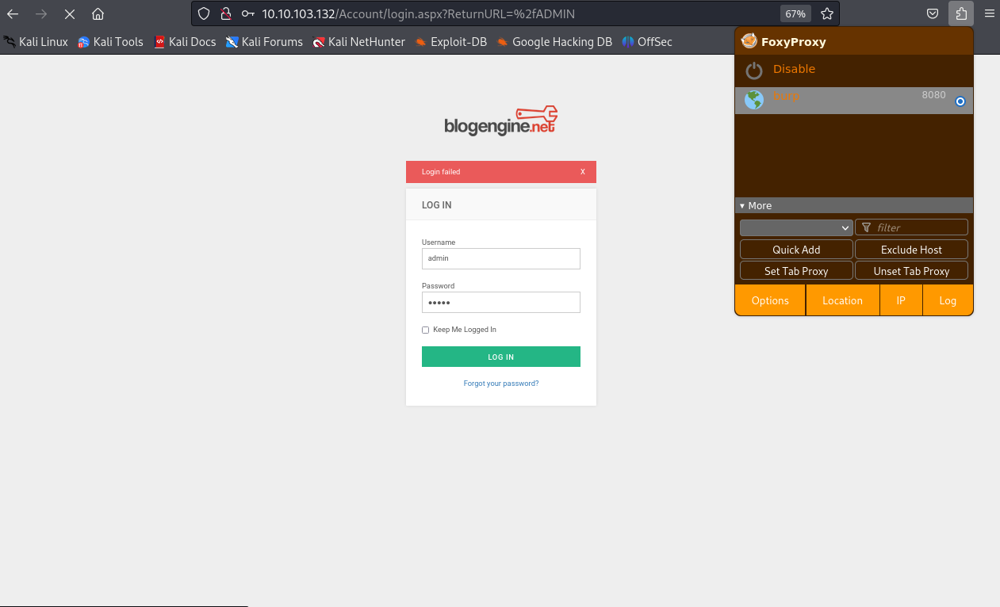
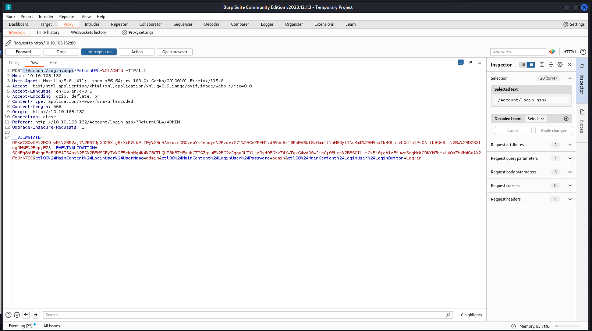
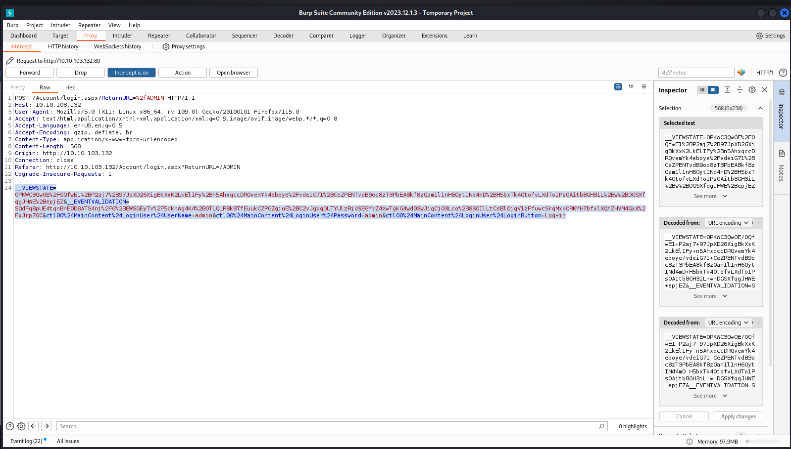

## TASK 1 ##

***QUESTION 1***<br>
Deploy the machine and access its webserver.

***ANWSER:*** <br>
Start the machine and head to the ip given. No answer is needed


It should look like this:



***QUESTION 2*** <br>
What is the name of the clown displayed on the homepage ?

To find this we have to reverse image search the image and check on the internet on what the internet often calls it . To do this, we have to grab the .png file and search on the internet . like so :


If You look on the google search we see that a name appears on the twice. That's our answer

Answer : `Pennywise`

 ## TASK 2 ##


To solve this task Burpsuite,Hydra and Gobuster is needed to find the login page.

The first step finding the log in page using gobuster.

```┌──(honeybadger㉿kali)-[~]
└─$ gobuster  -u  10.10.103.132 -w /usr/share/dirb/wordlists/big.txt dir
===============================================================
Gobuster v3.6
by OJ Reeves (@TheColonial) & Christian Mehlmauer (@firefart)
===============================================================
[+] Url:                     http://10.10.103.132
[+] Method:                  GET
[+] Threads:                 10
[+] Wordlist:                /usr/share/dirb/wordlists/big.txt
[+] Negative Status codes:   404
[+] User Agent:              gobuster/3.6
[+] Timeout:                 10s
===============================================================
Starting gobuster in directory enumeration mode
===============================================================
/Archive              (Status: 200) [Size: 8325]
/Blog                 (Status: 500) [Size: 1208]
/Admin                (Status: 302) [Size: 173] [--> http://10.10.103.132/Account/login.aspx?ReturnURL=/Admin]                                                                                
/ADMIN                (Status: 302) [Size: 173] [--> http://10.10.103.132/Account/login.aspx?ReturnURL=/ADMIN]                                                                                
/Content              (Status: 301) [Size: 152] [--> http://10.10.103.132/Content/]
/Default              (Status: 500) [Size: 1763]
/Scripts              (Status: 301) [Size: 152] [--> http://10.10.103.132/Scripts/]
/Search               (Status: 200) [Size: 8407]
/Contact              (Status: 200) [Size: 9935]
/ContactUs            (Status: 200) [Size: 9937]
/account              (Status: 301) [Size: 152] [--> http://10.10.103.132/account/]
/admin                (Status: 302) [Size: 173] [--> http://10.10.103.132/Account/login.aspx?ReturnURL=/admin]                                                                                
/appcode              (Status: 301) [Size: 152] [--> http://10.10.103.132/appcode/]
/archive              (Status: 200) [Size: 8325]
/archive1             (Status: 200) [Size: 8326]
/archived             (Status: 200) [Size: 8326]
/archive2             (Status: 200) [Size: 8326]
/archivedimages       (Status: 200) [Size: 8332]
/archived-pages       (Status: 200) [Size: 8332]
/archives             (Status: 200) [Size 8326]
/archiver             (Status: 200) [Size: 8326]
/archives30           (Status: 200) [Size: 8328]
```
The output has been shortened but If you look try out the directories  you'll eventually find that the  `/ADMIN` directory leads us to the log in page. BINGO!


Now that we have the directory that allows us to login we have to intercept the request on burp suite when we try to login so that we can brute force to find the password. The hint says the usernames is admin so we type in admin for the username and then put a random password that will be substituted against our password list.




Here's the intercepted  post request we need to run our attack to  find the password. The 2 highlighted things needed are:
- line 1  /Account/login.aspx: This is the path to the login page on the web server. "Account" is a directory, and "login.aspx" is the specific page (ASP.NET page in this case) handling the login functionality.:





- line 14 is the the login attempt we made. This is useful because we ca replace the password with a wordlists so we can find it:


