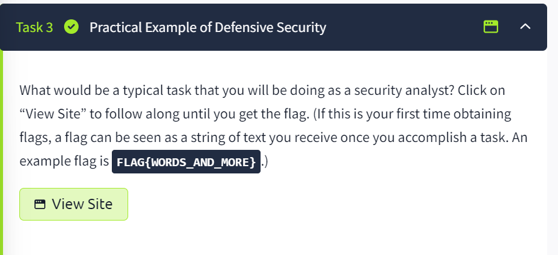
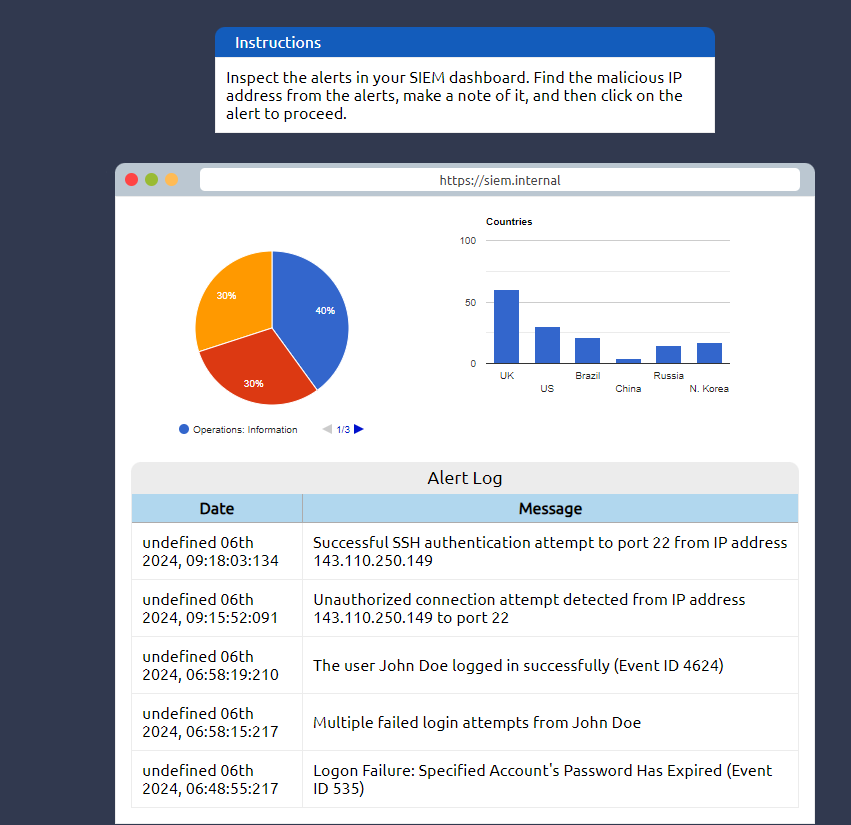
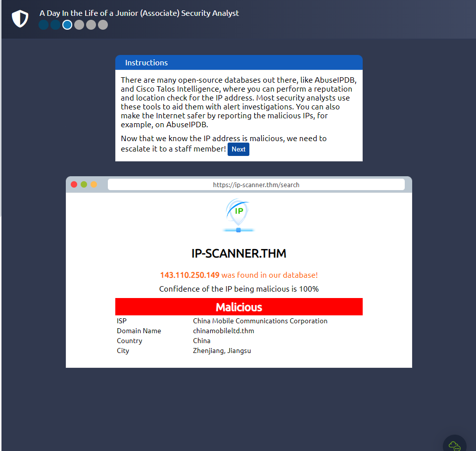
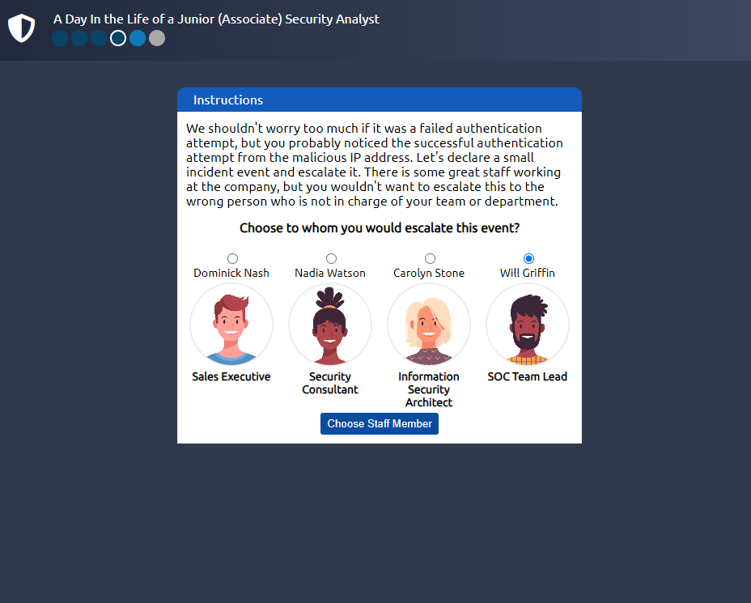
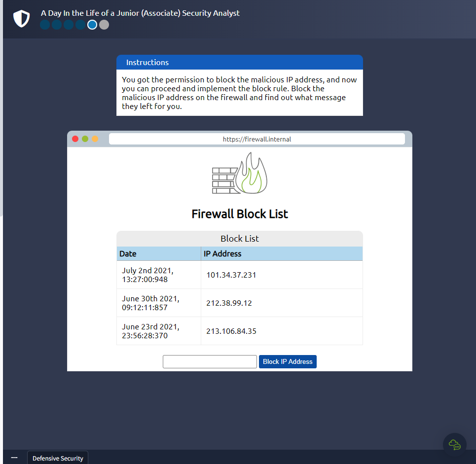
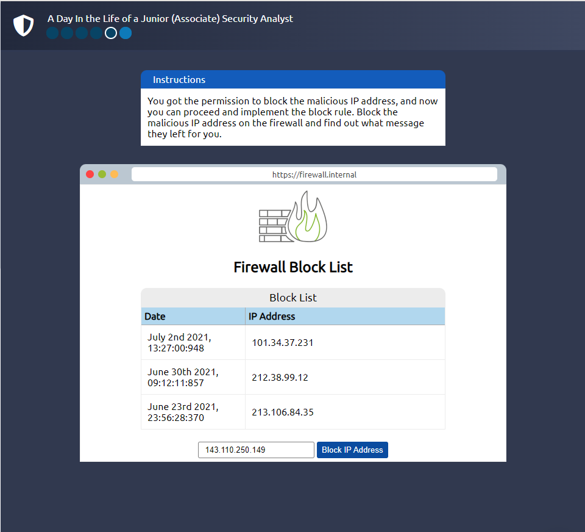
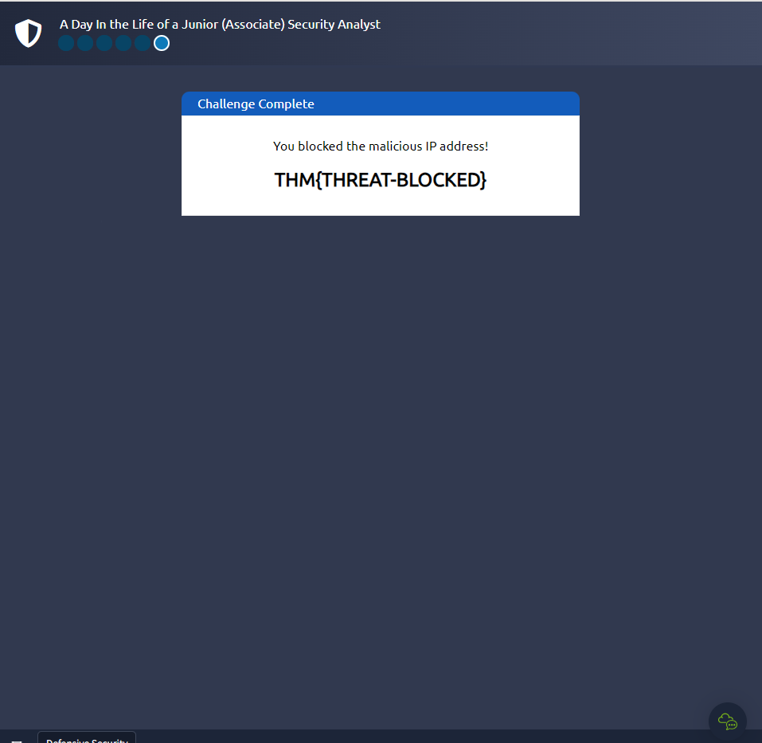

THE first 2 sections are reading tasks. Here's a simplified explanation. Some of the content has be kept the same because they're just fine

## TASK 1 - Introduction to  Defensive  Security

Defensive security is like being a security guard for your house. Instead of trying to break in, you focus on keeping intruders out and making sure you know if someone tries to get in. You might install strong locks, set up alarms, and regularly check for signs that someone tried to break in, like footprints or open windows.

In the digital world, defensive security experts, often part of blue teams, work to prevent cyber attacks from happening in the first place. They set up strong defences such as firewalls and antivirus software to block attackers. They also monitor systems for any signs of suspicious activity, like unusual login attempts or strange behaviour in computer networks. If they detect something wrong, they investigate and take action to stop the attack and protect the system.

Terms listed: Explained
 * User cyber security awareness: This means teaching people how to protect themselves and their devices from online threats. It includes things like recognizing suspicious emails, creating strong passwords, and being cautious about what they download or click online.

* Documenting and managing assets: This involves keeping track of all the computers, devices, and systems that a company or organization uses. By knowing what they have, they can make sure everything is protected and working properly.

* Updating and patching systems: Just like how you update your phone or computer to get new features, updating and patching systems means installing new software that fixes any problems or weaknesses. This helps keep hackers from taking advantage of known issues.

* Setting up preventative security devices: Imagine a security guard at the entrance of a building. A firewall works like that guard for computers and networks. It decides who or what can come in or leave. An Intrusion Prevention System (IPS) is like a security camera that spots and stops any suspicious activity before it can cause harm.

* Setting up logging and monitoring devices: Logging is like keeping a detailed diary of everything happening on a network. It records who's using what and when. Monitoring is like having security guards watch the cameras and logs in real-time. They look for anything unusual, like a stranger sneaking into a building, to stop problems before they get serious.

***QUESTION*** 
Which team focuses on defensive security?

 
 
 
 
 

***ANSWER*** 
Blue Team

 

## TASK 2 - Areas of Defensive Security

1. A ***Security Operations Centre (SOC)*** is a team of cyber security professionals that are on the look out for activity from the bad guys (hackers) on a network or the operating system
They focus on :

* Vulnerabilities: Whenever a system vulnerability/CVE (weakness) is discovered, it is essential to fix it by installing a proper update or patch This because hackers are always on the job and one the best ways is to be working with the operating system providers because they release patches (that fix the vulnerabilities that were on the previous os version ) .When a fix is not available, the necessary measures should be taken to prevent an attacker from exploiting it. Although remediating vulnerabilities is of vital interest to a SOC, it is not necessarily assigned to them.

* Policy violations: We can think of a security policy as a set of rules required for the protection of the network and systems. For example, it might be a policy violation if users start uploading confidential company data to an online storage service.

* Unauthorized activity: Consider the case where a user’s login name and password are stolen, and the attacker uses them to log into the network. A SOC needs to detect such an event and block it as soon as possible before further damage is done.
Network intrusions: No matter how good your security is, there is always a chance for an intrusion. An intrusion can occur when a user clicks on a malicious link or when an attacker exploits a public server. Either way, when an intrusion occurs, we must detect it as soon as possible to prevent further damage .Security operations cover various tasks to ensure protection; one such task is threat intelligence.

2. ***Threat Intelligence***

Threat  intelligence refers to information they  gather about actual and potential enemies. A ***threat*** is any action that can disrupt or adversely affect a system. Threat intelligence aims to gather information to help the company better prepare against potential adversaries. The purpose would be to achieve a threat-informed defence. Different companies have different adversaries. Some adversaries might seek to steal customer data from a mobile operator; however, other adversaries are interested in halting the production in a petroleum refinery. Example adversaries include a nation-state cyber army working for political reasons and a ransomware(a type of malware that disables you from accessing your files and data that may be lost if the hackers requirements aren't met  ) group acting for financial purposes. Based on the company (target), we can expect adversaries.

Intelligence needs data. Data has to be collected, processed, and analyzed. Data collection is done from local sources such as network logs and public sources such as forums. Processing of data aims to arrange them into a format suitable for analysis. The analysis phase seeks to find more information about the attackers and their motives; moreover, it aims to create a list of recommendations and actionable steps.

Learning about adversaries allows you to know their tactics, techniques, and procedures. As a result of threat intelligence, we identify the threat actor (adversary), predict their activity, and consequently, we will be able to mitigate their attacks and prepare a response strategy.

3. ***Digital Forensics and Incident Response (DFIR)***
Forensics is the application of science to investigate crimes and establish facts. With the use and spread of digital systems, such as computers and smartphones, a new branch of forensics was born to investigate related crimes: computer forensics, which later evolved into, digital forensics.

In defensive security, the focus of digital forensics shifts to analysing evidence of an attack and its perpetrators and other areas such as intellectual property theft, cyber espionage, and possession of unauthorized content. Consequently, digital forensics will focus on different areas such as:

File System: Analysing a digital forensics image (low-level copy) of a system’s storage reveals much information, such as installed programs, created files, partially overwritten files, and deleted files.
System memory: If the attacker is running their malicious program in memory without saving it to the disk, taking a forensic image (low-level copy) of the system memory is the best way to analyse its contents and learn about the attack.
System logs: Each client and server computer maintains different log files about what is happening. Log files provide plenty of information about what happened on a system. Some traces will be left even if the attacker tries to clear their traces.
Network logs: Logs of the network packets that have traversed a network would help answer more questions about whether an attack is occurring and what it entails.
Incident Response
An incident usually refers to a data breach or cyber attack; however, in some cases, it can be something less critical, such as a misconfiguration, an intrusion attempt, or a policy violation. Examples of a cyber attack include an attacker making our network or systems inaccessible, defacing (changing) the public website, and data breach (stealing company data). How would you respond to a cyber attack? Incident response specifies the methodology that should be followed to handle such a case. The aim is to reduce damage and recover in the shortest time possible. Ideally, you would develop a plan ready for incident response.

The four major phases of the incident response process are:

Preparation: This requires a team trained and ready to handle incidents. Ideally, various measures are put in place to prevent incidents from happening in the first place.
Detection and Analysis: The team has the necessary resources to detect any incident; moreover, it is essential to further analyse any detected incident to learn about its severity.
Containment, Eradication, and Recovery: Once an incident is detected, it is crucial to stop it from affecting other systems, eliminate it, and recover the affected systems. For instance, when we notice that a system is infected with a computer virus, we would like to stop (contain) the virus from spreading to other systems, clean (eradicate) the virus, and ensure proper system recovery.
Post-Incident Activity: After successful recovery, a report is produced, and the learned lesson is shared to prevent similar future incidents.

Malware Analysis 
Malware stands for malicious software. Software refers to programs, documents, and files that you can save on a disk or send over the network. Malware includes many types, such as:

***Virus*** is a piece of code (part of a program) that attaches itself to a program. It is designed to spread from one computer to another; moreover, it works by altering, overwriting, and deleting files once it infects a computer. The result ranges from the computer becoming slow to unusable.

***Trojan Horse*** is a program that shows one desirable function but hides a malicious function underneath. For example, a victim might download a video player from a shady website that gives the attacker complete control over their system.

***Ransomware*** is a malicious program that encrypts the user’s files. Encryption makes the files unreadable without knowing the encryption password. The attacker offers the user the encryption password if the user is willing to pay a “ransom.”

### Security Operations Centre (SOC) ###

Purpose: A SOC is like a security guard for a company's digital world.

Tasks: They monitor the company's networks and systems 24/7 to spot and stop any suspicious activity or cyber attacks. They use special tools to watch out for anything unusual and respond quickly if they see a problem.

Goal: The main goal is to keep the company’s data and systems safe from hackers and other cyber threats.

Digital Forensics and Incident Response (DFIR)
Digital Forensics: Imagine you are a detective, but for computers. When a cyber attack happens, digital forensics experts investigate to find out what happened, how it happened, and who did it. They look at digital evidence like logs and data files to piece together the story of the attack.

### Incident Response: ###
This is like the emergency team that jumps into action during and after a cyber attack. They work to stop the attack, fix any damage, and make sure it doesn’t happen again. They also communicate with the SOC and use their findings from digital forensics to improve security.
In short, the SOC focuses on preventing and detecting cyber attacks, while DFIR investigates and responds to attacks that have already happened. Together, they help keep a company’s digital world safe and secure.

# Types of Malware Analysis #

1. Static analysis works by inspecting the malicious program without running it. Usually, this requires solid knowledge of assembly language (processor’s instruction set, i.e., computer’s fundamental instructions).

2. Dynamic analysis works by running the malware in a controlled environment and monitoring its activities. It lets you observe how the malware behaves when running.

## QUESTION ##
What would you call a team of cyber security professionals that monitors a network and its systems for malicious events?

 
 

***ANSWER***
 
Security Operations Center

## QUESTION ##
What does DFIR stand for?

 
 

***ANSWER***
 
Digital Forensics and Incident Response

## QUESTION ##
Which kind of malware requires the user to pay money to regain access to their files

 
 

*ANSWER*
 
Ransommware

## TASK 3 - practical

1. First step Click on view site

2. Second step -Find the malicious IP address and type it .
  "Inspect the alerts in your SIEM dashboard. Find the malicious IP address from the alerts , take a note and then click on the alert to proceed"

What's ***SIEM***    Stands for Security Information and Event Management. It's a tool that helps keep an eye on everything happening on a computer network to spot any unusual or suspicious activity. It collects data from different parts of the network, like servers and security devices, and looks for patterns that might indicate a security threat. If it finds something suspicious, it alerts the security team so they can take action quickly. SIEM also helps create reports and ensures that the organization is following security regulations. In short, SIEM is like a security guard that watches over a company's digital systems, looking for trouble and helping to stop it.

What's  an ***IP address?***  It's the  number used to identify a device on a network.

If you look through the log of the SIEM you see that the most suspicious activity is the unauthorized connection attempt from the IP ***143.110.250.149***
click on that log and type it in the next page as shown in the image below:

3. Third Step - Report the incident 
We have to report to person monitors the company's networks and systems 24/7 to spot and stop any suspicious activity or cyber attacks as mentioned earlier, ***SOC***. After we've selected the right person, we can continue

Here we can put in the IP address that was sus earlier, the IP that attempted an unauthorized login, 143.110.250.149

Lets block it!

And there we have it. The Flag's is THM{THREAT-BLOCKED}

