## Task 1 - What are the Packets and Frames
---

When data is sent over a network, it is broken down into smaller units called **packets**. These packets are individual segments of the entire data set and are sent separately across the network. Each packet contains a piece of the original data, along with information like the sender's address, the receiver's address, and sequence information to ensure that the packets can be reassembled correctly at the destination. Once all packets reach the receiving computer, they are reassembled into the original form of the data.

**Frames** and **packets** are both small pieces of data, but they operate at different levels in a system called the OSI Model, which helps organize how data moves across networks.
Frames are used at the data link layer (Layer 2), where there is no need to worry about IP addresses yet.
Packets, on the other hand, are used at the network layer (Layer 3) where IP addresses (like a digital address for computers) come into play.

Imagine sending a letter. You put it in an envelope (this represents a packet with the IP Address ), and inside this envelope is another, smaller envelope (the frame with the Data ), which holds the actual message (the data). So, the frame is like a second layer of protection that helps carry the data from point A to point B.

**Question:**  
What is the name for a piece of data when it does have IP addressing information?

  
<strong>Click to see Answer</strong>

  Packet

 
 

**Question:**  
What is the name for a piece of data when it does not have IP addressing information?

  
<strong>Click to see Answer</strong>

  Frame

## Task 2 - TCP/IP (The Three-Way Handshake)
---
This protocol is very similar to the OSI model the TCP/IP protocol consists of four layers and is arguably just a summarised version of the OSI model. The layers are:

- Application
- Transport
- Internet
- Network Interface

Why does TCP Model has its own model When its part of the OSI?

Historically speaking TCP/IP model was developed before the OSI model in the 1970s. TCP/IP was created in the 1970s as part of early research to connect different types of networks and computers (leading to what we now call the internet). As the internet grew, TCP/IP became the standard protocol suite for data transmission.

OSI Model: It’s a theoretical/conceptual model that outlines how data should ideally be transmitted across a network. The OSI model is not used directly in networking but serves as a guideline for how protocols should be structured, broken into 7 distinct layers. Each layer has specific responsibilities, and this helps standardize network communication.

TCP/IP Model: This is the practical model actually used on the internet for data transmission between devices. It consolidates some of the OSI layers into just 4 layers and focuses on how things work in real-world networks. It defines the protocols (like TCP, IP, HTTP, etc.) that govern how data is sent and received across the internet.

In short:

OSI Model = Conceptual framework (how data should be sent)
TCP/IP Model = Practical framework (how data is actually sent)

TCP headers are a part of each TCP packet, containing key information about how the data is transmitted and managed. These headers include fields such as source and destination ports, sequence numbers, acknowledgment numbers, flags, and more. This information is crucial for ensuring proper communication, error checking, and the reliable transmission of data between devices in a network.

Their roles:

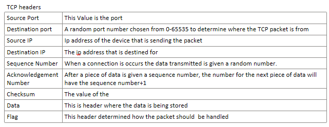

**The three way handshake** is is the term for the process used to established between 2 devices. And is done with Several flags below:

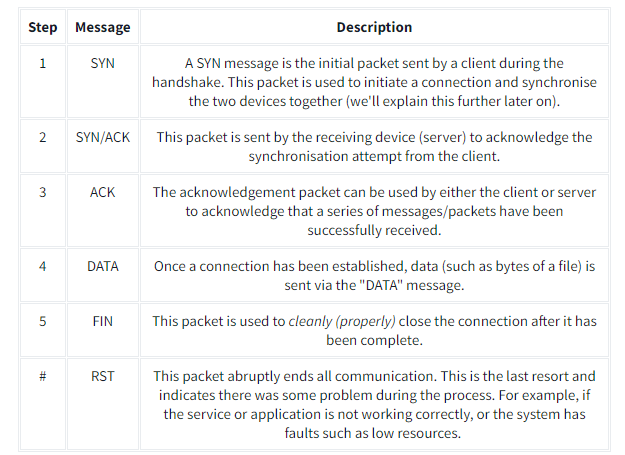

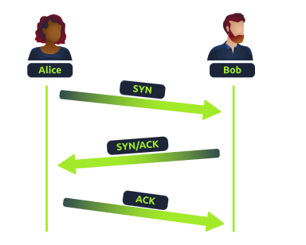

When two computers want to communicate, they need to agree on the order of the data they will send. To do this, they use something called sequence numbers, which help them keep track of where the data starts and how to piece it back together.

First Step (SYN): The computer that wants to start the conversation (let's call it the "client") sends a message to the other computer (the "server") saying, "Hey, let's talk! Here's my starting number, let's call it 0." This number helps to identify the starting point of the data.

Second Step (SYN/ACK): The server responds with, "Got it! Here's my starting number, let's call it 5,000. Also, I acknowledge (confirm) that I received your starting number of 0."

Third Step (ACK): The client replies, "I acknowledge your starting number of 5,000. Now, I'll send my data starting from my number plus 1 (so, 0 + 1 = 1)."

Why does this happen?

This back-and-forth is called the TCP three-way handshake. It helps both computers agree on how to organize and send the data in the right order, so nothing gets mixed up. Sequence numbers make sure the data gets sent and received in the correct sequence, ensuring reliable communication.

**Questions**
What is the header in a TCP packet that ensures the integrity of data?

  
<strong>Click to see Answer</strong>

  checksum

**Questions**
Provide the order of a normal Three-way handshake (with each step separated by a comma)

  
<strong>Click to see Answer</strong>

  SYN,SYN/ACK,ACK

**TCP Ending and a connection**

Here’s how the process of closing a TCP connection works, explained in simple terms:

Alice finishes talking: When Alice has said everything she wants, she sends a message to Bob saying, "I’m done!" (In technical terms, Alice sends a FIN packet, which means "finish"). This signals that Alice is ready to close the conversation.

Bob confirms he heard Alice: Bob responds with, "Okay, I got it!" (This is called an ACK, which means "acknowledgment"). This lets Alice know that Bob has received her message.

Bob finishes talking: If Bob has more to say, he finishes up his part. When he’s done, he also says, "I’m finished!" (Bob sends his own FIN packet).

Alice confirms she heard Bob: Alice responds one last time with, "Okay, I got it!" (Alice sends a final ACK).

After both Alice and Bob are done and have confirmed that they’ve both received each other’s messages, the connection is closed, and they can free up the "line" for other conversations (or free up system resources in the case of computers).

In TCP, this back-and-forth process ensures that both devices know the conversation is over and that no data gets lost.

In Summary
FIN Packet: One device (e.g., Alice) sends a FIN packet to the other device (e.g., Bob), indicating that it’s finished sending data.
ACK Packet: The receiving device acknowledges this by sending an ACK packet back, confirming it got the message.
Second FIN Packet: The receiving device, when it's done sending data, also sends a FIN packet.
Final ACK: The first device responds with a final ACK, and the connection is fully closed.

## Task 3 - Practical - Handshake
Help Alice and Bob communicate by re-assembling the TCP handshake in the correct order in the static lab attached to this task!

Enter the value of the flag given at the end of the conversation into the question below.

**Walkthrough**

**Question**
What is the value of the flag given at the end of the conversation?

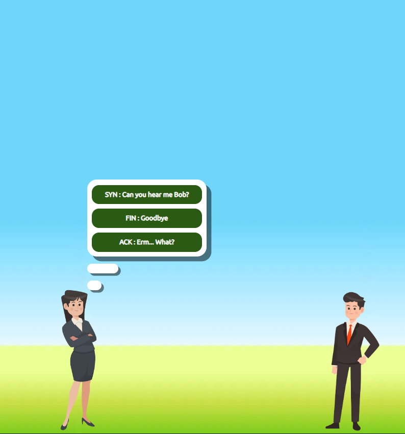
 

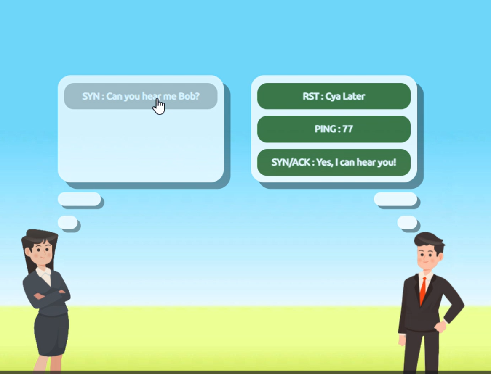
 
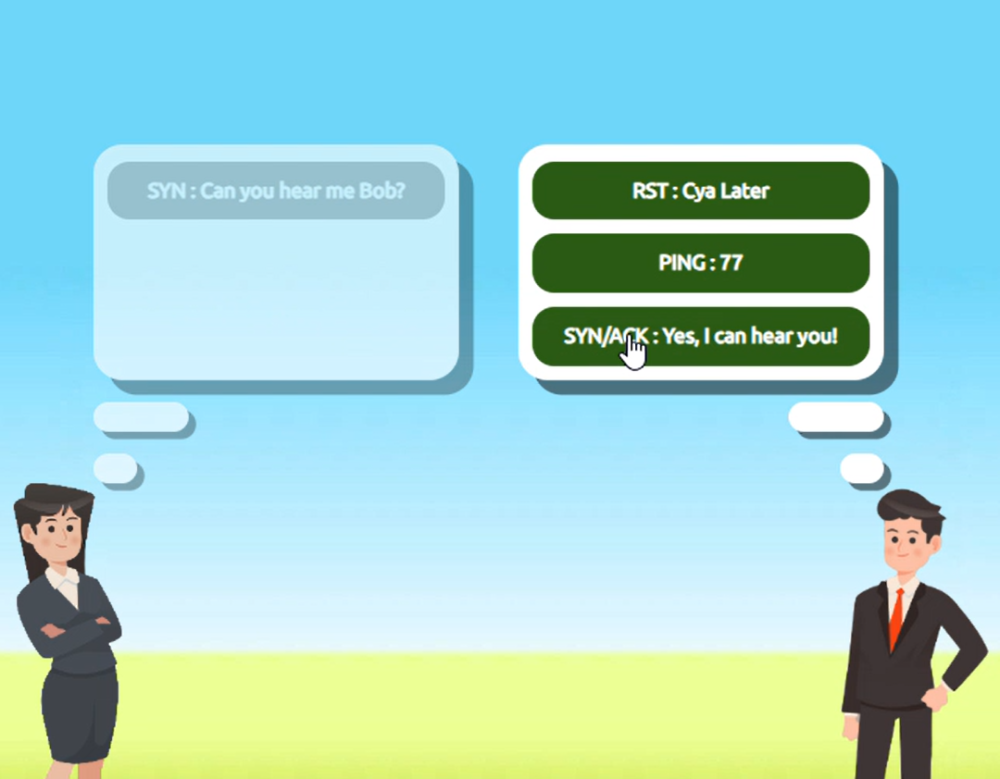
 
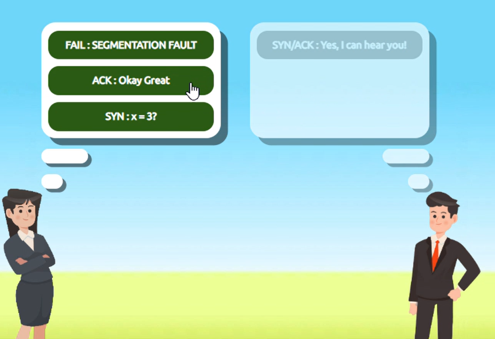
 
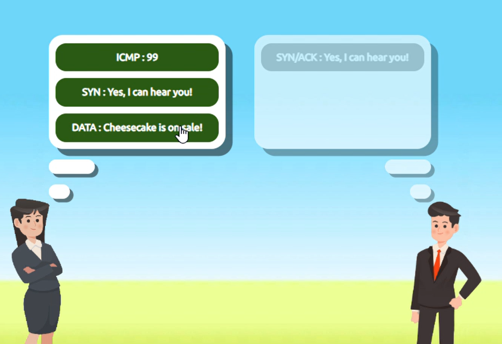
 
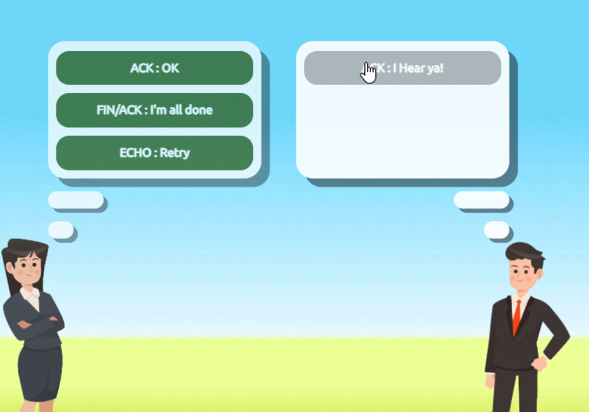
 
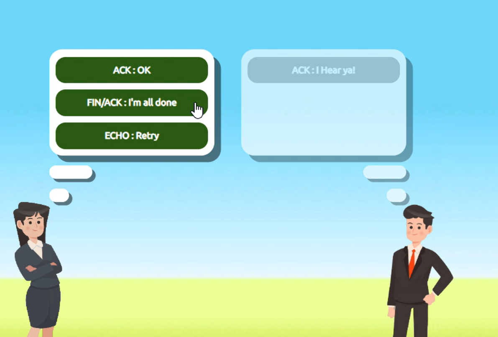
 
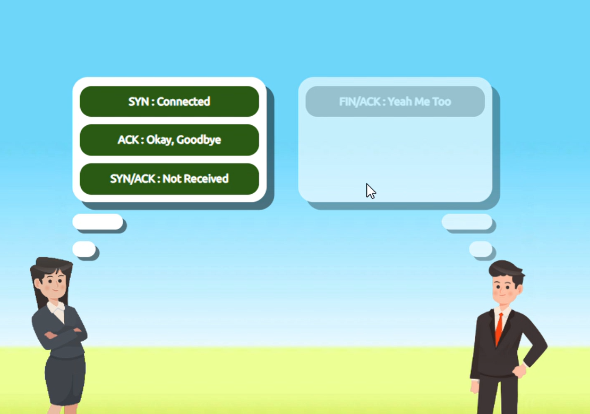
 
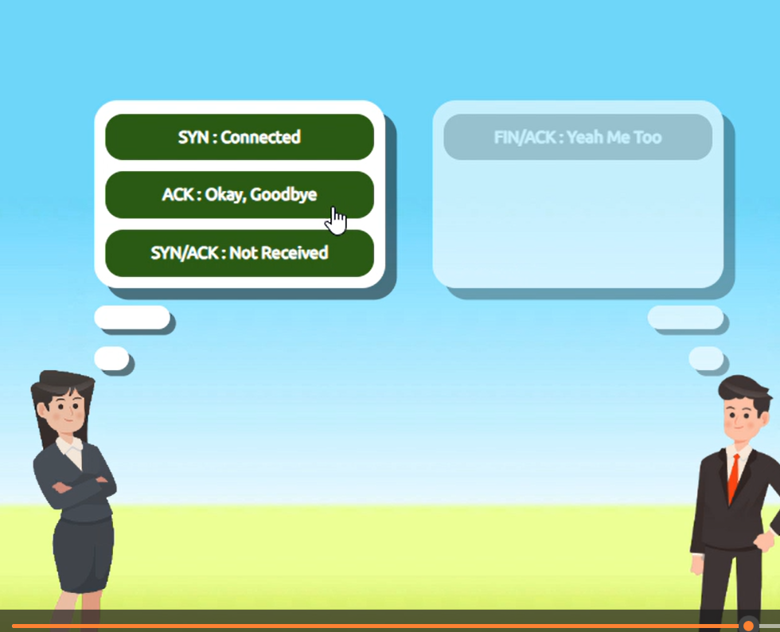

  
<strong>Click to see Answer</strong>

  THM{TCP_CHATTER}

## Task 4 - UDP/IP ##

**UDP** (User Datagram Protocol) serves the same purpose as TCP, which is to send packets only this time UDP doesnt establish a session to ensure it its sent to the right person

UDP (User Datagram Protocol) is similar to TCP in that it sends data packets across a network. However, unlike TCP, UDP is connectionless/stateless and does not establish a session before sending data. This means UDP doesn't guarantee that the packets will arrive at their destination, nor does it check if they’re received in the correct order.

UDP uses IP addresses and port numbers to direct data to the right recipient, but it doesn’t ensure the data gets there or ask for confirmation. This makes UDP faster than TCP but less reliable. It's commonly used in applications where speed is more important than perfect delivery, such as video streaming, online gaming, or voice calls.

## Task 5 - Ports 101 (Practical) + Protocols  ##
What is a Protocol?
A protocol is like a language that computers use to communicate. Just as humans need to agree on a language (English, Spanish, etc.) to understand each other, computers need to agree on a protocol. For example:

HTTP is the protocol for web browsing (how websites are sent and displayed).
SMTP is the protocol for sending emails.
Each protocol defines rules for how the data should be structured, sent, and received. These rules are the same across all computers, which allows them to communicate effectively.

What is a Port?
A port is like a door to a specific service on a computer. Your computer has many services (web browser, email client, file transfer, etc.) running at once. Each of these services is "listening" on a different port for incoming data.

For example:

Port 80 is the door for receiving web traffic (HTTP).
Port 25 is the door for email traffic (SMTP).
Why Use Ports Instead of Protocol Numbers?
Imagine your computer as a large building with many rooms (services). The IP address of your computer is like the building address, and the port numbers are the room numbers inside the building. When data arrives at the building, the protocol tells it how to be handled, and the port tells it where to go.

Now, if we only used protocols (languages) and no ports (room numbers), all the data would arrive at the same place with no way of telling which service (web browser, email client, etc.) it was meant for. Ports allow multiple services to use the same protocol but be directed to different  applications(Browsers, Emails)

Example:
Let’s say your computer receives two types of data at the same time:

Data for a website (HTTP, port 80).
Data for email (SMTP, port 25).
Both HTTP and SMTP are different protocols. If the system only had protocol numbers (like a language), it wouldn’t know how to tell the two services apart on the same computer. Using ports, the computer knows:

Data for port 80 goes to the web browser.
Data for port 25 goes to the email program.
Conclusion
Protocols and ports work together to direct data. Protocols define how communication happens, and ports ensure the data goes to the right service on your device.

When connecting to a device using its IP address and a port number, we’re specifying the device we want to communicate with (via the IP) and the specific service or application we want to access (via the port).

For example, if we have a device with the IP address 8.8.8.8 and we connect to it on port 1234, we are targeting a specific service running on that port. While port 1234 doesn't have a standard service tied to it (unlike port 80 for websites or 22 for SSH), it can still be used for any service, such as SSH, if configured to do so.

In the case of port 80, this would typically indicate a web service (like a website). But if you were connecting to a custom service, such as a command-line interface (CLI) through SSH, it could be configured to run on port 1234.

So, the combination of the IP address and the port number tells your device not only where to connect but also which specific service to interact with on the remote device.

  
<strong>Click to see Answer</strong>

  THM{TCP_CHATTER}

## Task 6 - Continue  Your Learning: Extending Your Network  ##

