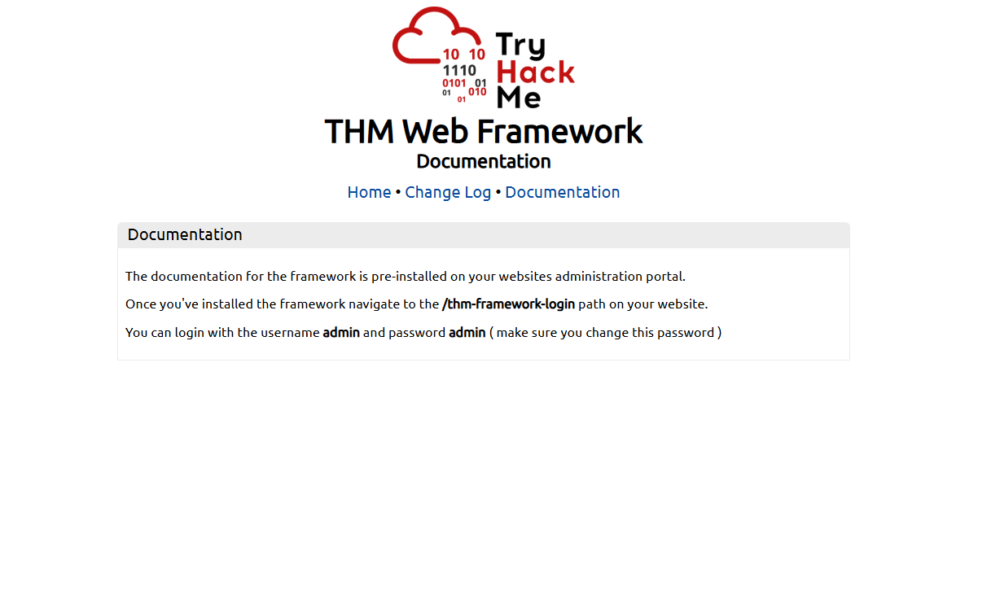
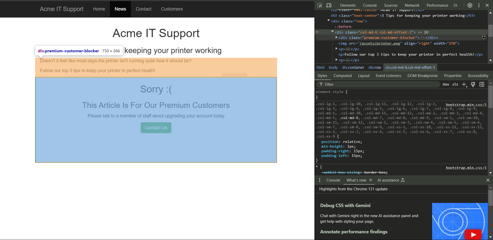

## Task 1 - Walking an Application ##


This rooms covers tools that internet browsers use  such as :
- ***View Source***<br>
- ***Inspector***<br>
- ***Debugger***<br>
- ***Network***<br>


Press the "Start Machine" button to start the virtual machine on this task, then wait 2 minutes, and visit the following URL: https://LAB_WEB_URL.p.thmlabs.com (this URL will update 2 minutes from when you start the machine)


***Question***<br>
I confirm that I have deployed the virtual machine and opened the website.


## Task 2 - Exploring the website ##


Websites have interactive parts where users send or receive information. These parts can include things like:

- ***Login forms*** (where users type in their username and password)<br>
- ***Search bars***<br>
- ***Contact forms***<br>

These areas are where attackers might try to sneak in, so you need to pay extra attention to them.

***How to Start***<br>
You don’t need to be a developer to start testing. Simply open the website in your browser and begin exploring.

- Click through different pages to see what features exist.
- Test things that ask for user input, like forms or login areas.
- Take notes on what you find, especially any features that look like they might be risky or poorly secured.

For example, if you were reviewing the Acme IT Support website, you’d go through its pages and list things like:

- The login form on the homepage
- A "Contact Us" page with a form to send messages
- A client support chat feature

For each part, you’d summarize its purpose and whether it seems secure or not.
By testing these features, you’re checking if they could be vulnerable to attacks. If you find any inssues, you’ll report them so the website owners can fix them before someone with bad intentions takes advantage of them.

With the site we're reviewing on this machine here's what each part mean in laynmans terms:


Home Page<br>
/<br>
This page contains a summary of what Acme IT Support does with a company photo of their staff.<br>


Latest News<br>
/news<br>
This page contains a list of recently published news articles by the company, and each news article has a link with an id number, i.e. /news/article?id=1<br>

News Article<br>
/news/article?id=1<br>
Displays the individual news article. Some articles seem to be blocked and reserved for premium customers only.<br>

Contact Page<br>
/contact<br>
This page contains a form for customers to contact the company. It contains name, email and message input fields and a send button.<br>

Customers<br>
/customers<br>
This link redirects to /customers/login.<br>

Customer Login<br>
/customers/login<br>
This page contains a login form with username and password fields.<br>

Customer Signup<br>
/customers/signup<br>
This page contains a user-signup form that consists of a username, email, password and password confirmation input fields.<br>

Customer Reset Password<br>
/customers/reset<br>
Password reset form with an email address input field.<br>

Customer Dashboard<br>
/customers<br>
This page contains a list of the user's tickets submitted to the IT support company and a "Create Ticket" button.<br>

Create Ticket<br>
/customers/ticket/new<br>
This page contains a form with a textbox for entering the IT issue and a file upload option to create an IT support ticket.<br>

Customer Account<br>
/customers/account<br>
This page allows the user to edit their username, email and password.<br>

Customer Logout<br>
/customers/logout<br>
This link logs the user out of the customer area.<br>


***Question***<br>
Read the above.


## Task 3 - Exploring the website ##

When you visit a website, your browser receives some code from the server. This code is like the blueprint that tells your browser:

-  What to show you (HTML): This decides the structure and content, like headings, paragraphs, and links.<br>
-  How it looks (CSS): This adds colours, fonts, and styling.<br>
-  How it works interactively (JavaScript): This adds functionality, like buttons or animations.<br>

You can view this "blueprint" by checking the Page Source.<br>
Here’s how:

- Right-click on a webpage and select "View Page Source" (or something similar).<br>


-  Alternatively you can type view-source: before a URL in the address bar, like view-source:https://example.com.<br>


-  Go to your browser's menu, often under "Developer Tools," to find this option.<br>


### Understanding Pagesource ###

Sometimes, developers leave ***comments*** in the code (written between (`<!--  and  -->`). These don’t show on the website but can give hints about what's happening behind the scenes, like temporary pages or ongoing updates.

### Elements,Attribute names, Attribute Values ###


Before i explain what these featutes are A penetration tester needs to understand HTML (the code that builds web pages) because that's where websites might have weaknesses that can be exploited. For example:<br>

 - XSS (Cross-Site Scripting): This happens when websites don't properly check what users type in. Attackers can trick the site into running bad code, which could steal information.

 - SQL Injection: Websites often talk to databases to get or store data. If the site doesn’t check user input carefully, someone could trick the site into making dangerous requests to the database, like stealing or changing data.

 - Insecure Links: Sometimes, links on a website can lead to areas that aren’t properly protected, allowing attackers to sneak into private sections of the website.

- Improper Handling of Data: Websites ask users for information through forms or in URLs. If the site doesn't handle this data carefully, attackers might be able to use it to break things or get sensitive information.

Now lets go through what html code does:

 <br>
***Elements/tags***: Elements are like the building blocks of a webpage. They define what the content will look like.<br>For example, a header, a paragraph, or a picture.<br>
Example: ```<title>Acme IT Support - Home</title>``` Makes the  title of  the page<br>
```<title </title>``` Is the element in this line of code
<br><br>
***Attribute name***: An attribute is a special feature that gives extra information about the element. It tells the browser how the element should behave or look.<br>
Example: ```< <li><a href="/contact">Contact</a></li>">Click here</a>```<br>
```href``` is attribute name in this line of code

<br>
***Attribute value***:The value tells the browser exactly how to use the feature from the attribute. It gives more specific details about what the element will do.<br>
Example: ```<li><a href="/contact">Contact</a></li>```<br>
The href value is ```/contact``` this  line of code

### Frameworks ###


A framework is a set of pre-made tools and structures that helps developers build websites or apps more easily. It's like a set of building blocks that provide basic functions, so developers don't have to create everything from scratch. For example, it might include features like user accounts or blogs already built in.

In simpler terms, it's like a template that gives developers a head start with common tasks. But unlike a template, which mostly focuses on the look and feel, a framework also provides functionality, like managing data or handling security.
Frameworks might have common features like user accounts or blogs already included. Viewing the page source can reveal:

- Which framework is in use.
- The version of the framework.
- If the framework isn’t updated, hackers might exploit known weaknesses in older versions. By visiting the framework's website or update notes, you could identify whether the site has vulnerabilities.

### Assets ###

Assets are usually a hidden page that shows the files what is used it to make the website. They are not always enabled.
However, if a hacker gains access to these files, they might be able to see sensitive information such as:
<br>
***Sensitive data***: If there are misconfigured files or exposed credentials.<br><br>
***Code***: If JavaScript or other files contain logic or keys that could help the attacker<br> exploit vulnerabilities.<br><br>
***Configuration files***: These might include database connections or other private data that could assist in an attack.

To go this page type ```/assets``` at the end of the webpage


In this exercise:<br>
- Check the code comments for temporary pages.<br>
- Look for hidden links like "secr."<br>
- Explore directories (folders) for files that shouldn’t be visible, like "flag.txt."<br>
- Identify the framework and version, then check if it’s outdated or vulnerable.<br>

This is the kind of information ethical hackers use to test a website’s security.


***Question***<br>
What is the flag from the HTML comment?(hint:Make sure you go to the link mentioned in the comment.)


The first comment written in `<!-- -->` is what we should be paying attention to. There's a page they listed. Go to it.

<details>`
  <summary><strong>Click to see Answer</strong></summary>
  THM{HTML_COMMENTS_ARE_DANGEROUS}
</details>


***Question***<br>
What is the flag from the secret link?(hint:What is the flag from the secret link?)
The secret link they mentioned is found in a comments in the code.

 Its similar to the  previous question  but this time it's attribute value:""/secret-page"
 <summary><strong>Click to see Answer</strong></summary>
  THM{NOT_A_SECRET_ANYMORE}
</details>


***Question***<br>
What is the flag from the secret link?

<details>
  <summary><strong>Click to see Answer</strong></summary>
  THM{INVALID_DIRECTORY_PERMISSIONS}
</details>


***Question***<br>
What is the directory listing flag?

If you go the directory "/assets" you'll see the an asset called flag.txt click on it


<details>
  <summary><strong>Click to see Answer</strong></summary>
THM{INVALID_DIRECTORY_PERMISSIONS}
</details>


***Question***<br>
What is the framework flag?

To solve this we have to find where framework version information is located. If you look through the page source you'll eventually see it like this:


If you look the pages and read up on documentation. It says we can go a directory and log in as admin with the password admin.



Here's the log in page we have access to.Sign in and retrieve the flag


<details>
  <summary><strong>Click to see Answer</strong></summary>
THM{KEEP_YOUR_SOFTWARE_UPDATED}
</details>


## Task 4 - Developer Tools - Inspector ##


The ***Inspector*** shows you the live structure of the webpage you're looking at. Think of it as the blueprint of the website at this exact moment.
<br><br>
Why it's helpful:
Websites don’t always look the same as their "source code" because they can change dynamically (e.g., using JavaScript or CSS). The Inspector shows you what’s actually being displayed in real time.
You can also interact with the page—like changing text, hiding elements, or even editing colors—to see how the website responds.
Example:
You see a login button. Using the Inspector, you can highlight it, view its code, and even temporarily change its text to "Log Me In" to see how that looks.


This is how the website looks like for the user.


If we right click on the site and we go to inspect button we can see the site's code and make changes to it


After traversing through the code from:<br>
```<div class="container" style="padding-top:60px">```
<br>to<br>
```<div class="row">```
<br>to<bR>
```<div class="col-md-6 col-md-offset-3"><div class="premium-customer-blocker">```
<br>to<br>
```<div cass="col-md-6 col-md-offset-3"><div class="premium-customer-blocker">```
We can see the section of code that prevents us from viewing all the content. If go to the display section and change it from block  none. The hidden section and flag will be revealed.

***Question***<br>
What is the flag behind the paywall?


<details>
  <summary><strong>Click to see Answer</strong></summary>
  THM{NOT_SO_HIDDEN}
</details>


## Task 5 - Developer Tools -  Debugger <br> ##
What it does: It helps you see and control the JavaScript code running on the page.
<br>Websites often use JavaScript to handle forms, buttons, and other interactive features. With the Debugger, you can pause a section the code form runningh temporary, step through it line by line, and figure out how it works.  This called ***breakpoints***
Example:
If you suspect the website has hidden validations on a login form (e.g., password must be 12 characters), you can use the Debugger to find and even disable those checks temporarily.

To understand how this lets practice on the site.

First we go to the  contact page, right click and go to ***inspect***.


<br>

Then  head over to  source > assets > flashmini.js then scroll down  that allows us to view the code that flashes temporarily. Click on the hyphen on that start of the line of code to pause it. It's highlighted in blue. Then refresh to see the flag


<details>
  <summary><strong>Click to see Answer</strong></summary>
  THM{CATCH_ME_IF_YOU_CAN}
</details>


## Task 6 - Developer Tools - Network <br> ##
What it does: It shows you all the behind-the-scenes traffic between your browser and the website—like requests for files, data sent to servers, and responses you get back.

Why it's helpful:
This feature lets you see what’s being sent and received, which can reveal sensitive data, hidden API calls(API calls are like conversations between your browser and a website’s server, where your browser asks for information or sends data, and the server responds with what you need.), or how forms work under the hood.
Example:
You fill out a form but notice it sends more data than what you entered. The Network tab can reveal what’s really being sent to the server.
<br><br>


Lets pratice on the ACME site.


First we right click on the contact page and go to the network section.

Then we type up a message and send it.

<br>
You should receive a message confirming that the message has gone through.


***Question***<br>
What is the flag shown on the contact-msg network request?


<details>
  <summary><strong>Click to see Answer</strong></summary>
  THM{GOT_AJAX_FLAG}
</details>


In short :<br>
The ***Inspector*** is like opening the hood of a car to see how the engine is running.<br>
The ***Debugger*** is like slowing down the engine to watch it work step by step.<br>
The ***Network tool*** is like checking the car’s dashboard to see how fuel (data) is flowing in and out.<br>
These tools are powerful for understanding and testing how websites function, whether you're a web developer fixing bugs or a Pentester looking for vulnerabilities.<br>
