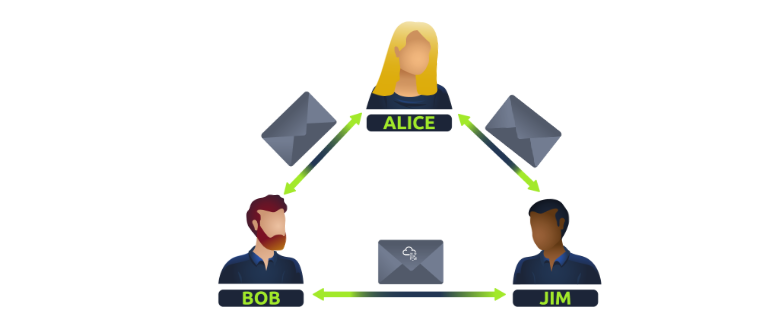
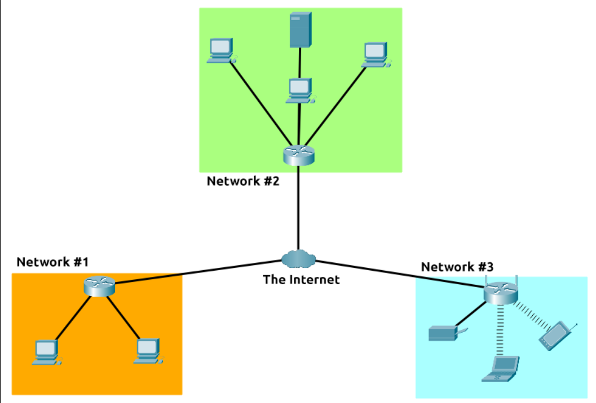
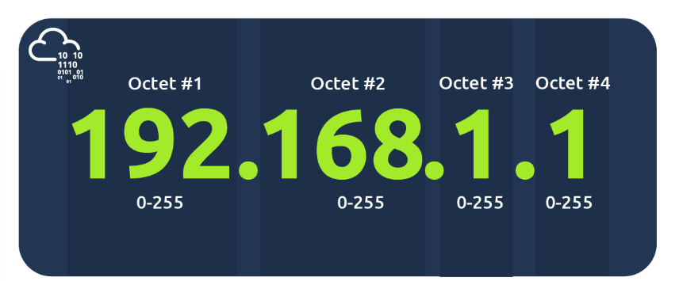
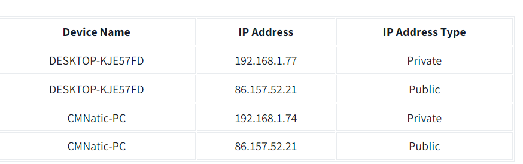
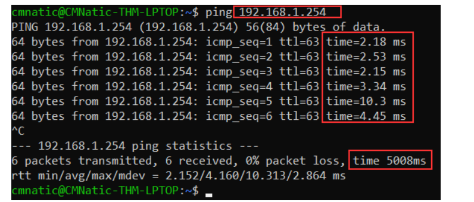
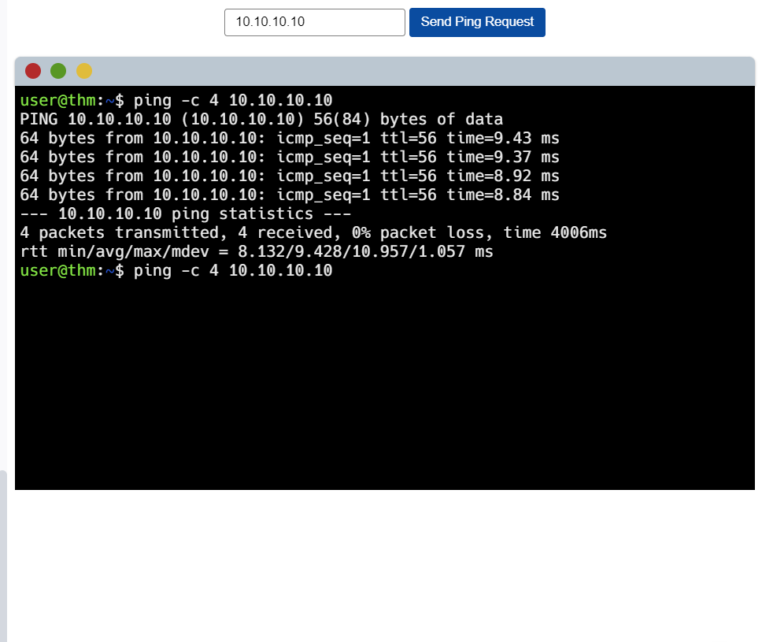
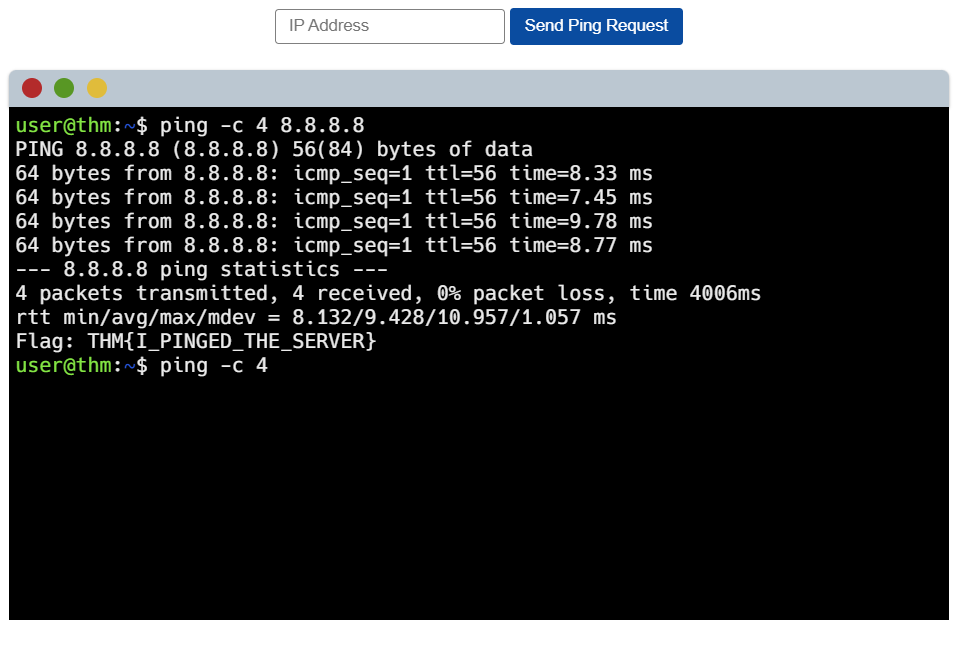

## Task 1 - What is Networking ##

Put simply, networks are group of devices connected together.

**Question** 
What is the key term for devices that are connected together

  
<strong>Click to see Answer</strong>

  Networks

## Task 2 - What is the internet ##

The internet is a vast network of smaller networks, all interconnected. These smaller networks can include local networks in homes, businesses, universities, and governments, as well as larger networks operated by internet service providers. Together, these networks form a massive, global network that allows computers and devices to communicate with each other, regardless of their physical location.

#### Brief history of the internet ###

It  started in 1960s known as  the ARPANET project which was funded by the United States Defence department. This was a very basic form of internet known as the node-node communication. In 1989 the internet that we all use today was eventually  created by Tim Berners-Lee(WWW-World Wide Web)

**Question**
Who invented the World Wide Web?

  
<strong>Click to see Answer</strong>

  Tim Berners-Lee

 
 

## Task 3 - identifying Devices a network
If a network is composed of many devices that are interconnected to communicate with each other, who would know who is who on the network and how would they be able to send information to who they want to. That's when **Ip Addresses** come into play. So what is it?

**Ip(Internet Protocol) Addresses** are unique numbers used to represent a device on a network which can change over a period of time.

These numbers are divided into 4 parts known as octets. These octets represent binary information, which is the computer's language, and they help identify the location of a computer on the network. The structure of octets allows for a large number of possible variations, ensuring that many devices can have unique IP addresses, enabling effective communication across the network.

"There are 2 types of IP addresses:

Public IP Addresses: These are used to identify a device on the **internet**. This is from your internet service provider

Private IP Addresses: These are used to identify devices within a **local network**, allowing them to communicate with each other." This given by your **router**  

As we all know there are millions of millions of users on the internet which means there must be a lot public IP addresses because if one ip Addresses is the same as another person this will prevent information going to the right person. Initially public Ip addresses where using Ipv4 which had 4.29 billion addresses But was not enough. So IPV6 was created and supports ip addresses up to  340 trillion IP addresses Its 340,282,366,920,938,000,000,000,000,000,000,000,000

The second type of address related is networking is the Mac address

**MAC Addresses** 
Every Computer that can connect to the internet has a network interface card.  The mac address is for  sending information on a local network. It is made has a twelve character hexadecimal split into two's and separated by a colon.

But here’s the twist: people can "fake" these name tags in a process called spoofing. This means a device pretends to be someone else’s device by copying their name tag (MAC address). So, if a network is set up to trust certain devices, like an administrator’s computer, someone could fool the system into thinking they're that device, sneaking into places they’re not supposed to be.

It’s like showing up to a party with someone else's name tag and getting VIP access! This is why relying on MAC addresses alone for security can be risky if someone knows how to spoof them.

## Questions ##

**Question** 
What does the term "IP" stand for

  
<strong>Click to see Answer</strong>

  Internet protocol

 
 

**Qustion** 
What is each section of an IP address called?

  
<strong>Click to see Answer</strong>

  Octet

**Question** 
 How many sections (in digits) does an IP address have?

 

   
<strong>Click to see Answer</strong>

   4
 

**Question** 
What does the term "MAC" stand for

  
<strong>Click to see Answer</strong>

  Media access control

## Task 4 -Ping   ##

 Ping is a network utility that measures or response time between two devices over a network, typically between your computer and a server. It operates using the ICMP (Internet Control Message Protocol) to send Echo Request packets to a target host and waits for Echo Reply packets.

 

In the screenshot they were pinging the private address 192.168.1.254. Ping states that we sent 6 ICMP packets which were recived in 4.16 secs.

Lets do a demo to learn how to actually ping.

## Lab Practice ##

***Step 1*** 
Type in Ip address 10.10.10.10 and click on the send ping request button.

Note!  the command "-C" is basically how many packets you want to send. So in this case its 4 packets. Unto the next.

***Step 2***  
Type in 8.8.8.8 to ping to it.....! There's the flag

## Questions ##

**Question**
What does protocol
does ping use

  
<strong>Click to see Answer</strong>

  ICMP

**Question**
What is the syntax to ping 10.10.10.10?

  
<strong>Click to see Answer</strong>

  ping 10.10.10.10

**Question**
What flag do you get when you ping 8.8.8.8

  
<strong>Click to see Answer</strong>

  THM{I_PINGED_THE_SERVER}

## Task 5 ##

In summary

Here’s a layman's summary:

***Networking*** is about connecting devices together to share information. When devices are connected, we call this a network.

The ***Internet*** is a giant network of smaller networks, like those in homes, schools, businesses, and big companies. It started in the 1960s with a project by the U.S. Defense Department and has grown ever since. In 1989, Tim Berners-Lee created the World Wide Web (WWW), which made the internet what it is today.

Each device in a network has a unique number called an ***IP address***, which helps identify it and allows it to communicate. There are two types:

***Public IP addresses*** are used to identify devices on the internet. 
***Private IP addresses*** identify devices in local networks, like within your home.
Since there are so many devices, we now use a system called IPv6 to provide enough IP addresses for everyone.

Another identifier, called a ***MAC address***, is like a "name tag" for a device’s network card. This lets devices recognize each other on a local network. Some people can "spoof" (fake) a MAC address, which is why trusting only MAC addresses for security can be risky.

***Ping*** is a tool that checks the connection between two devices. It sends small data packets to see how fast they reach the other device and come back. This is useful for testing if a device can be reached on a network.

That's this room done see you in the next room!

One more thing please like and share the site. It helps the content grow and reach others interested in offensive  security

Thanks

Eleazer
